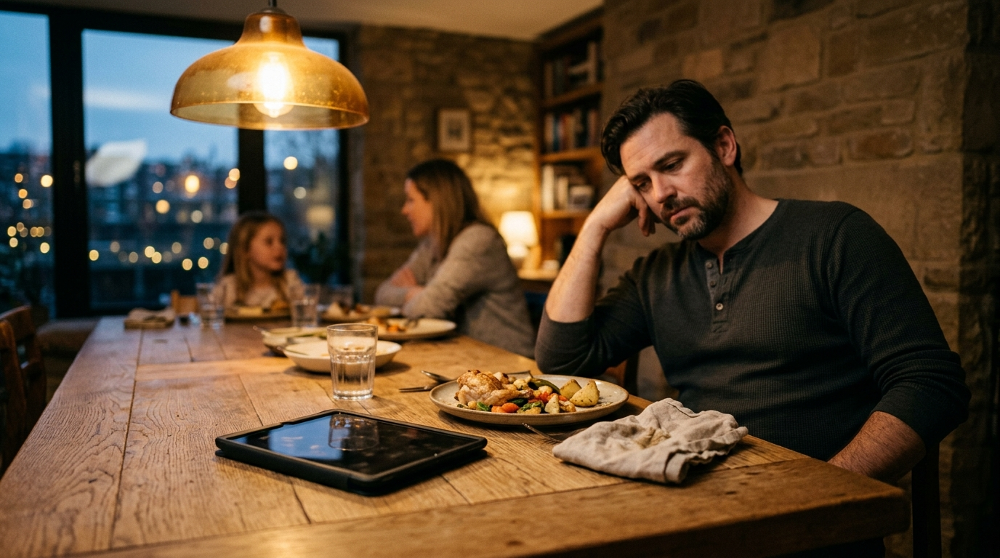
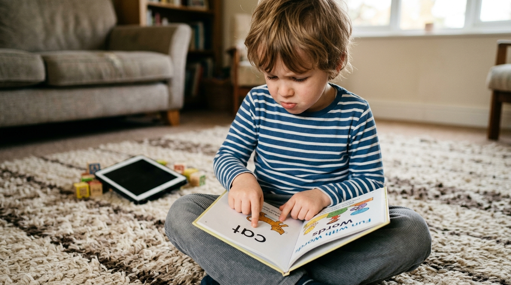
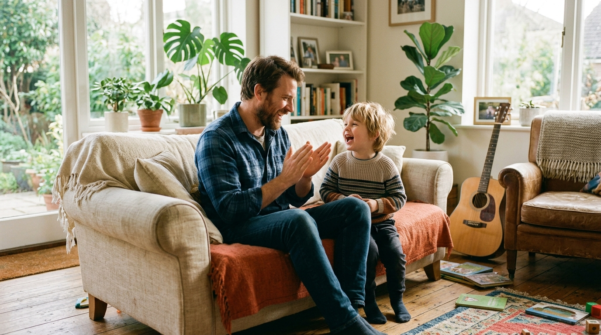
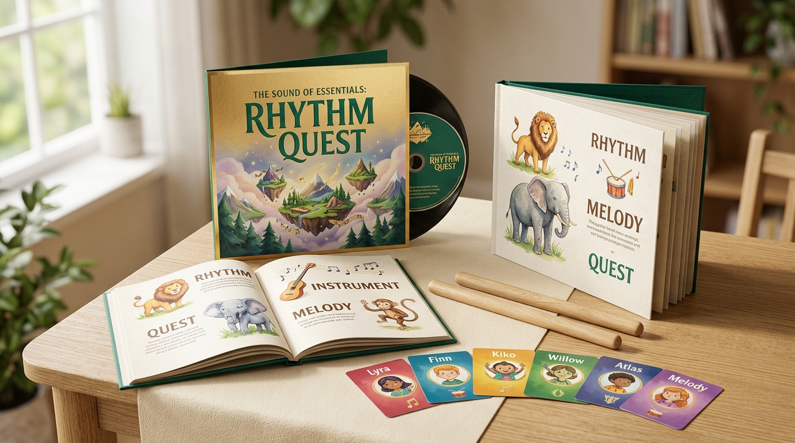

# I Spent $240 on "Top-Rated" Reading Apps. Here Are 5 Reasons I Deleted Every Single One

> **Subtitle:** By an Austin software engineer and dad of two. A plain-English breakdown of why tablet reading apps reward guessing, what an acoustic session actually looks like on a Tuesday evening, and why we replaced subscriptions with screen-free music.

- **Author:** David M., Software Engineer & Father of Two (Ages 3 & 5)
- **Review:** Verified Parent Contributor · 8 min read · September 2026
- **Category:** Early Literacy & Child Cognitive Development
- **Canonical URL:** [thesoundofessentials.com/dad-reading-apps-review](https://thesoundofessentials.com/dad-reading-apps-review)

---

I build software systems for a living. I am not anti-technology, and when it comes to my children's education, I do not cut corners on cost. When my son turned four, I paid $120 upfront for an annual subscription to the top-rated phonics app in the app store. Six months later, frustrated by sluggish progress, I bought a second subscription to another well-known reading platform for another $120.

On paper, my son looked like a genius. His dashboard claimed 88% phonics mastery. He could unlock screens, customize digital avatar outfits, and collect virtual gold coins faster than an adult. He knew the app's internal reward loop inside out.

Then one weekend, I opened an ordinary paper book with three-letter words and pointed to the word **CAT**.

He froze. He looked at my face, shifted his feet, and guessed: *"Tiger?"*

I flipped the page and pointed to the word **SUN**. He looked at the tiny yellow drawing in the upper corner of the page and said: *"Daytime?"*

He was not decoding letters. He was playing an interactive guessing game. Worse, whenever the daily 20-minute tablet timer locked the screen, he went into a screaming meltdown that wrecked dinner and derailed the entire evening. My wife and I were paying a monthly fee to lease a digital pacifier that left our child dysregulated and illiterate.

> 💡 *"Whenever a product promises it can 'rewire' how a child learns, my immediate instinct as an engineer is to look for the catch. I don't want another vague promise about neuroplasticity. I want a plain description of what happens on a Tuesday evening."*

Here are the five practical truths I learned after cancelling both subscriptions, purging the apps, and finding an acoustic, screen-free method that actually taught my son how to read.

---

## 1. Gamified Apps Reward Visual Guessing, Not Phonics Decoding

Sit behind your child while they play an educational app. Look closely at where their pupils go. They are not looking at letter shapes or sounding out phonemes. They are scanning the screen for the interactive graphic clue.

When the app asks, "Find the word *dog*," there is almost always a cartoon picture of a golden retriever right above the letters D-O-G. A young child's brain takes the path of least resistance. Your kid taps the dog. The app flashes gold stars, sounds a trumpet fanfare, and marks another correct answer on your parent dashboard.

Educators call this the context-guessing trap. It creates an artificial illusion of reading. The moment you hand that child a real book without animations, the crutch vanishes. They stare at the page, panic, and start guessing random words based on the first letter they see.

---

## 2. The Twenty Minutes of Quiet Is Borrowed Calm, and the Tantrum Is the Interest

Every tired parent understands the temptation of the tablet handoff. You need to cook dinner, reply to an urgent client email, or fold laundry. Handing over the iPad purchases twenty minutes of absolute silence.

The problem is what happens at minute twenty-one. When the screen goes dark, your child erupts into tears, throws shoes, or screams at the dinner table. For months, I thought my son had an anger management problem.

In reality, it is basic biochemistry. High-speed visual animations, flashing particle effects, and dinging reward sounds flood an immature nervous system with continuous dopamine. When you take the screen away, dopamine plunges below baseline. The child experiences an abrupt physical crash. That twenty minutes of quiet was borrowed calm, and the forty-minute post-screen tantrum was the brutal interest payment on the loan.

---

## 3. EdTech Business Models Optimize for Screen Retention, Not Quick Graduation

I work with product managers every day. The north-star metrics of venture-funded software companies are Daily Active Users (DAU), average session length, and monthly churn rate. If a phonics app taught your child how to read independently in sixty days and your family cancelled the subscription, the software company would consider that a churn failure.

That is why reading apps look like mini-casinos. They pack in virtual pet rooms, collectible badges, spinning prize wheels, and avatar accessories. None of those features teach reading. They exist solely to condition your child to demand the app every single afternoon so you never cancel your credit card billing.

> **The Subscription Trap:** Real phonics is a finite skill set. Once a child masters auditory sound segmentation, letter-sound correspondence, and phonetic blending, they read real books on paper. They do not need level 240 on an iPad. When an app stretches early reading into years of digital mini-games, it is harvesting your child's attention to protect a subscription revenue stream.

---

## 4. The Ear and Vocal Cords Wire Reading Faster Than an Index Finger

Strip away the marketing jargon about neuroplasticity. Here is the plain mechanical reality of how human language works: children speak years before they read. They learn spoken words through acoustic rhythm, voice inflection, and verbal call-and-response.

Reading is simply mapping written visual symbols onto the sounds a child already knows by ear. When a child sings a call-and-response track, their vocal cords, ears, and breath coordinate together. They feel where syllables start and stop. They physically articulate the difference between /b/ and /p/.

Tapping an iPad screen with an index finger bypasses that acoustic wiring entirely. A child who can break sounds apart with their ears can learn to read printed letters in weeks. A child who only taps glass stays stuck guessing at pictures.

---

## 5. What a Tuesday Evening Actually Looks Like (And What We Swapped In)

When a speech pathologist introduced us to **The Sound of Essentials: Rhythm Quest**, my immediate reaction was to search for the catch. Who runs it? How long does it take? And what happens in a house where a five-year-old is already conditioned to expect cartoon fireworks?

Here is the plain, unvarnished answer to what a session actually looks like in our house on a regular Tuesday evening:

### The Tuesday Evening Blueprint

- **Who Runs It:** The living room speaker and you (or passive background listening)
- **Time Required:** Exactly 10 to 15 minutes max
- **The Format:** 19 acoustic songs across 7 lands, 15 mentors
- **The Catch:** Zero subscriptions. Album is 100% free.

**Step 1 (Minute 0–2):** At 5:15 PM, while my wife finishes dinner, I turn on the kitchen Bluetooth speaker and play Track 4 or 7. There is no screen. The music is recorded with real acoustic guitars and live human vocals. The tempo is calm and deliberate.

**Step 2 (Minute 2–10):** The singer calls out a rhythmic sound phrase, and the mentor character answers. My son is usually playing on the rug with blocks. At first, he ignored it. By day four, he was singing the responses back to the speaker while snapping Legos together. He is practicing phoneme segmentation without realizing it is an educational lesson.

**Step 3 (Minute 10–15):** Right before dinner, we open the physical *Rhythm Quest Picture Dictionary* for five minutes. Because his ears already know the song words, he points at the letters on the page and says the sounds out loud. No screens, no battery warnings, and no tantrum when we sit down to eat.

---

## Comparison Matrix: Reading Apps vs. The Sound of Essentials

| Dimension | Mainstream Reading Apps | The Sound of Essentials |
| :--- | :--- | :--- |
| **Daily Evening Friction** | Battles over tablet timers & post-screen tears | Calm living room audio, zero device battles |
| **Parent Time Commitment** | Managing logins, troubleshooting tech glitches | 10–12 minutes of shared acoustic listening |
| **Learning Mechanism** | Visual guessing & cartoon tapping | Auditory sound segmentation & call-and-response |
| **Child's State After Session** | Overstimulated, dopamine crash | Co-regulated, calm, cooperative |
| **Commercial Model** | $10–$20/month recurring subscription trap | Deluxe 19-Track Album free for founding families |
| **Privacy & Tracking** | In-app telemetry, ad monetization, data mining | 100% ad-free, zero tracking, parent-sovereign |

---

## What Happens in a House Conditioned by Animations

If your child is used to high-speed animations, flashing lights, and cartoon noises, here is the honest timeline of how the transition unfolds:

- **Days 1–3: The "Where's the Screen?" Phase:** Your child will look for the iPad. When they realize the music is playing from the shelf speaker, they will go back to their toys. Don't force them to sit still. Just let the acoustic songs play during breakfast and dinner prep.
- **Week 1: The Ear Takes Over:** By day five or six, the rhythm hooks them. You will hear them humming the melodies in the backseat of the car or while putting on shoes. They start asking questions about the characters (Harmonia, Kenji, and Aiko).
- **Week 3: The Tactile Connection:** Introduce the physical Picture Dictionary. Because the audio is already stored in their auditory memory, matching sounds to printed symbols feels like solving a puzzle rather than doing homework.
- **Day 30: Real Reading on Physical Paper:** Your child reads beginner books without picture crutches. Most importantly, your evenings are peaceful again. The screaming matches over tablet handoffs are completely gone.

---

## Founder Family Initiative: Get The Complete Deluxe Album Package Free

No recurring subscriptions. No credit card required. A complete 19-track acoustic sound-before-symbol foundation for families who want off the tablet treadmill.

- ✅ **Full 19-Track Studio Album:** Mastered live acoustic vocals across 7 learning lands.
- ✅ **15 Mentor Characters:** Integrated lessons in phonics, sharing, and self-regulation.
- ✅ **100% Ad-Free & Tracking-Free:** Zero data harvesting, zero subscription locks.
- ✅ **Instant Multi-Device Streaming:** Works on any phone, speaker, or home stereo.

[**Claim Your Free Deluxe Album Here →**](https://thesoundofessentials.com)  
*No credit card required. Instant access. Not a trial.*

---

## Direct Answers to Practical Questions

### What is the catch? Why is the 19-track album offered for free?
There is no catch, no trial expiration, and no automated recurring charge. The founders are educators and musicians who believe the foundational auditory layer of literacy should be freely accessible to every home. The project funds itself through optional physical print products (the 4,000-word Picture Dictionary and the Rhythm Ready tactile workbook) for parents who want physical materials on their bookshelf.

### Will a child conditioned by YouTube and video games actually listen to acoustic music?
Yes, provided you do not force them to sit in a chair and stare at a speaker. Children are innately musical. When you take away the visual overstimulation and put acoustic music on in the background during play, their nervous system naturally relaxes. Within a few days, the catchy call-and-response melodies take root without triggering dopamine resistance.

### Who has to run this? Can a busy working dad actually manage it?
You don't run a classroom. You press play on your phone or smart speaker during existing daily routines: in the car on the way to daycare, during morning breakfast, or while cleaning up toys. It requires zero lesson planning and takes zero extra minutes out of your workday.

### How does acoustic singing translate into reading printed words on paper?
Reading problems in kindergarten almost always stem from weak phonemic awareness (the ability to hear and separate individual sounds in spoken words). Rhythm Quest builds that auditory muscle through song. When you later introduce physical printed letters, the child already knows the sounds by heart and simply attaches the visual letter to an established acoustic memory.

---

*Editorial & Sponsor Disclosure: This review reflects verified personal family experiences using The Sound of Essentials early learning materials. Individual learning rates and developmental timelines vary. Always consult with certified pediatric or educational professionals regarding specific learning concerns.*
