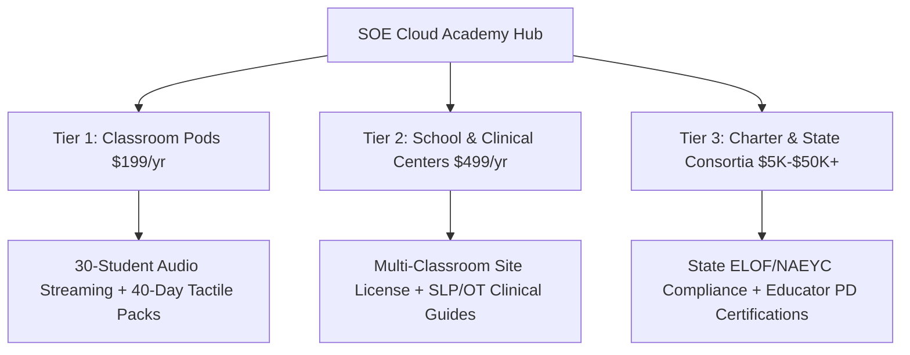
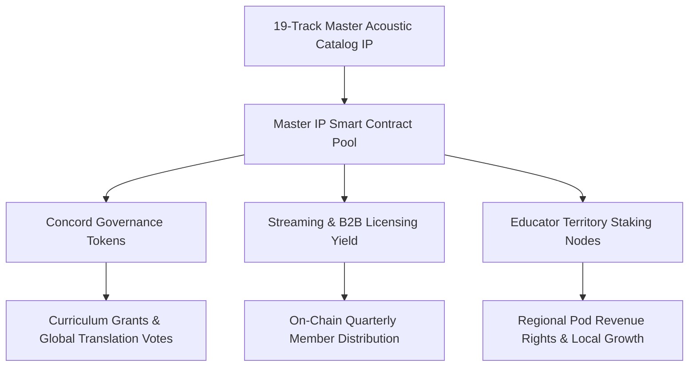
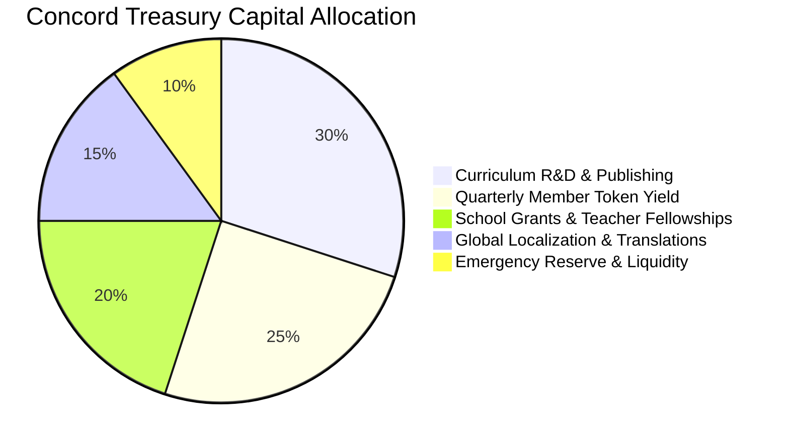

# The Sound of Essentials: Franchise Prospectus & Concord Master Blueprint

> **Confidential Institutional Briefing**  
> **Prepared for:** Future Concord Members, Institutional Partners, Charter Leaders, and Sovereign Cultural Patrons  
> **Brand & Intellectual Property:** The Sound of Essentials: Rhythm Quest  
> **Canon Date:** September 2026  
> **Core Thesis:** *"Designed for the developing brain, not the algorithm."*

---

```
┌─────────────────────────────────────────────────────────────────────────────────────────────┐
│                            THE SOUND OF ESSENTIALS CONCORD ECOSYSTEM                        │
├─────────────────────────────────────────────────────────────────────────────────────────────┤
│                                                                                             │
│     [ TACTILE LITERATURE ]          [ CLOUD ACADEMY ]         [ TOKENIZED CATALOG IP ]      │
│      15-Volume Hero Hardcovers       Decentralized Pods        On-Chain Master Rights       │
│      Eternal Father/Mother Canon     40-Day Sensory Engine     Streaming & Sync Dividends   │
│      180g Pressed Copper Vinyl       State DOE Compliance      Educator Staking Nodes       │
│                │                             │                            │                 │
│                └─────────────────────────────┼────────────────────────────┘                 │
│                                              ▼                                              │
│                                   THE EDUCATION CONCORD                                     │
│                      Sovereign Alliance of Educators, Artists & Patrons                     │
│                                                                                             │
└─────────────────────────────────────────────────────────────────────────────────────────────┘
```

---

## 1. Executive Summary & The Concord Charter

### 1.1 The Crisis of the Algorithmic Nursery
Early childhood education faces a systemic crisis. Over the past decade, foundational learning was outsourced to high-velocity digital screens, algorithmic video feeds, and gamified micro-rewards. The consequences across classrooms and homes are now documented:
- Severe attention fragmentation and sensory overstimulation.
- Chronic speech and articulation delays caused by passive viewing without acoustic feedback.
- Fine motor and bilateral coordination deficits resulting from glass-tapping rather than tactile grip.
- Teacher burnout and emotional dysregulation during foundational classroom circle times.

Mainstream EdTech responded by doubling down on tablets. **The Sound of Essentials (SOE)** rejects that path entirely.

### 1.2 The SOE Paradigm: Responsibility with Technology
SOE does not advocate for reactionary luddism. We advocate for **Responsibility with Technology**. Technology must serve the neurology of the child rather than exploit dopamine feedback loops.

To achieve this, SOE grounds early education (Pre-K to Grade 3, public framing ages 2 to 7) in three tried-and-true developmental pillars:
1. **Acoustic Sound and Cadence:** Rhythm is the brain's oldest organizing mechanism. Acoustic pacing (90 to 110 BPM) regulates vagal tone and synchronizes group attention naturally.
2. **Physical and Tactile Engagement:** Real pencils, physical paper turning, knuckle-stepping, and bilateral midline movement establish neural pathways that touchscreens cannot replicate.
3. **Human Mentorship:** Structured circle-time rituals where parents, educators, and children sing, speak, and learn together.

### 1.3 What is The Concord?
**The Concord** is the sovereign governing and capitalization council of The Sound of Essentials. It brings together forward-thinking educators, acoustic musicians, speech-language pathologists, charter school founders, and cultural patrons.

Concord members do not simply hold passive equity or purchase licenses. They hold fractional stewardship of a timeless cultural franchise. Through tokenized master intellectual property, high-margin tactile literature publishing, heirloom physical artifacts, and enterprise classroom adoption, Concord members guide and capitalize an educational infrastructure built to endure for generations.

---

## 2. World Model & Intellectual Property Moat

The SOE universe is built upon an interconnected pedagogical framework designed to make complex developmental milestones intuitive and joyful.

```
                  ┌──────────────────────────────┐
                  │      SERIPHIA (GUARDIAN)     │
                  │   Central Guide Spanning All │
                  └──────────────┬───────────────┘
                                 │
     ┌──────────────┬────────────┼────────────┬──────────────┐
     │              │            │            │              │
     ▼              ▼            ▼            ▼              ▼
[ HARMONIA ]   [ TERRASOL ]  [ NUMERIA ]  [ VITALIS ]  [ LUMINOSITY ]
 Kenji & Aiko   Vesta & Silas Octavia &    Amara & Felix Athena & Ezra
 Phonics/Music  Earth/Nature  Kwame Math   Body/Kinetic  Civics/Light
     │                                                       │
     └──────────────┬─────────────────────────┬──────────────┘
                    ▼                         ▼
               [ AQUARIA ]               [ CELESTIA ]
              Nerissa & Ronan            Selene & Elias
              Water & Emotion            Time & Seasons
```

### 2.1 The Five Core Domains of Essential Learning
Every track, workbook lesson, and classroom extension weaves across five foundational domains:
1. **Language & Phonics:** Phonological awareness, articulation, rhyme, and multisyllabic decoding.
2. **Cognitive & Math:** Pattern recognition, spatial orientation, number sense, and temporal sequencing.
3. **Physical & Somatic:** Midline crossing, bilateral coordination, knuckle-tapping, and breath control.
4. **Science & Inquiry:** Natural ecosystems, observation, weather, cycles, and material properties.
5. **Social-Emotional Learning (SEL):** Nervous system self-regulation, manners, empathy, and collective harmony.

### 2.2 The Seven Lands and Canonical Heroes
The narrative world translates these domains into seven storybook regions led by 15 canonical hero guides:

| Land | Core Domain & Focus | Color Anchor | Guide Heroes |
| :--- | :--- | :--- | :--- |
| **Harmonia** | Phonics, Acoustic Melody, Early Reading | Indigo (`#4F46E5`) | **Kenji & Aiko** |
| **Terrasol** | Earth Science, Botany, Soil, Living Creatures | Moss Green (`#5FB685`) | **Vesta & Silas** |
| **Numeria** | Number Sense, Geometry, Mathematical Logic | Vibrant Gold (`#F59E0B`) | **Octavia & Kwame** |
| **Vitalis** | Gross Motor, Somatic Calming, Midline Cross | Coral Red (`#EF4444`) | **Amara & Felix** |
| **Luminosity**| Civics, Community Roles, Visual Discovery | Radiant Amber (`#FBBF24`) | **Athena & Ezra** |
| **Aquaria** | Emotional Regulation, Sensory Flow, Compassion | Cerulean (`#5BA4C9`) | **Nerissa & Ronan** |
| **Celestia** | Temporal Awareness, Days, Months, Seasons | Twilight Purple (`#8B5CF6`) | **Selene & Elias** |
| **The Threshold**| Universal Guidance across all 7 Lands | Pure Light (`#EEF2FF`) | **Seriphia (Guardian)** |

### 2.3 The Scarcity Anchor: Lil G (Gabriel, "The Keeper")
In addition to the 15 public heroes, the franchise maintains a 16th character: **Lil G (Gabriel)**. Lil G is intentionally held in reserve as an unreleased narrative figure. He functions as a powerful lever for community membership conversion, high-tier collector drops, and secret classroom quest unlocks.

### 2.4 The Completed Asset Vault
SOE enters enterprise expansion with finished, defensible IP assets:
- **19-Track Master Acoustic Album:** Rich master studio recordings produced and arranged by seasoned musicians, featuring authentic live vocal performances, warm acoustic arrangements, and child-safe cadence.
- **4,232-Word Essential Picture Dictionary:** 157 illustrated thematic scenes spanning all seven lands. Formatted in EPUB 3 fixed-layout and high-resolution print PDF.
- **40-Day / 240-Activity Readiness Workbook:** Structured eight-week curriculum connecting daily motor, phonics, and cognitive exercises.
- **Standards Crosswalk & Compliance Engine:** Native CLI tools generating full pedagogical alignment to Head Start ELOF, NAEYC, and state early learning frameworks.

---

## 3. The Literature Franchise, Character Canon & Tactile Heirloom Ecosystem

```
┌─────────────────────────────────────────────────────────────────────────────────────────────┐
│                            THE SOE TACTILE LITERATURE ARCHITECTURE                          │
├─────────────────────────────────────────────────────────────────────────────────────────────┤
│                                                                                             │
│     [ 15 HERO QUEST NOVELS ]       [ THE MENTORSHIP CANON ]     [ TACTILE SENSORY ARTIFACTS ]│
│      14 Paired Hero Hardcovers      The Eternal Learning Fathers  Hardwood Clave Sticks      │
│      Seriphia Master Chronicle      The Eternal Learning Mothers  Copper Acoustic Chimes     │
│      Illustrated Land Cartography   Generational Wisdom Bedtime   Embroidered Quest Badges   │
│                                                                                             │
│                                           │                                                 │
│                                           ▼                                                 │
│                         [ THE SOVEREIGN SLIPCASE LIBRARY ]                                  │
│                 Collector-Grade Physical Publishing & Family Heirlooms                      │
│                                                                                             │
└─────────────────────────────────────────────────────────────────────────────────────────────┘
```

### 3.1 SOE as an Enduring Literature Franchise
At its core, **The Sound of Essentials is a literature franchise**. While software stacks become obsolete and educational apps cycle out of favor, physical children's books hold permanent real estate in homes, libraries, and classrooms. Works like Beatrix Potter, C.S. Lewis, Arnold Lobel, and Waldorf classics endure across generations because they respect the physical dignity of the printed page.

SOE treats literature as our foundational moat. Our stories are not digital app accessories; they are heirloom physical books designed to be held, smelled, re-read, and passed down from parent to child.

### 3.2 The 15 Hero Standalone Storybook Series
Each of the 14 paired land heroes and Seriphia possesses an independent narrative journey. These stories detail personal struggles, character discovery, and domain mastery:

1. **Kenji & Aiko (Harmonia):** *The Lost Acoustic Flute* and *The Whispering Valley*. Stories of active listening, speech clarity, and discovering the melodies hidden in everyday sounds.
2. **Vesta & Silas (Terrasol):** *The Underground Forest* and *The Seed That Remembered*. Tales of patient observation, rich soil biology, root systems, and seasonal harvests.
3. **Octavia & Kwame (Numeria):** *The Great Balance Scale* and *The City of Geometric Bridges*. Adventures in counting, spatial logic, symmetry, and architectural cooperation.
4. **Amara & Felix (Vitalis):** *The River of Steady Breaths* and *The Mountain of the Gallop*. Physical journeys exploring somatic strength, bilateral balance, and calming emotional storms through movement.
5. **Athena & Ezra (Luminosity):** *The Lantern in the Square* and *The Mapmaker's Compass*. Stories of community roles, honest craftsmanship, civic responsibility, and seeing clearly.
6. **Nerissa & Ronan (Aquaria):** *The Deep Tide Pool* and *The Song of the Calming Waters*. Emotional journeys teaching children to honor their feelings without being overwhelmed by them.
7. **Selene & Elias (Celestia):** *The Clock of the Starlit Valley* and *The Dance of the Twelve Moons*. Tales exploring time, seasonal transitions, evening gratitude, and circadian harmony.
8. **Seriphia (The Guardian):** *The Compass of the Seven Lands*. The overarching master epic uniting all seven lands and guiding young heroes along the path.

Each book is published as a 32- to 48-page collector hardcover with gold-stamped cloth spines, heavy wood-free art paper, and full-color matte illustrations.

### 3.3 The Lineage of Mentorship: Eternal Learning Fathers & Mothers
In modern children's entertainment, parental figures are frequently diminished, passive, or entirely absent. SOE fundamentally restores and elevates parental mentorship through the archetype of the **Eternal Learning Fathers** and **Eternal Learning Mothers**.

```
                           ┌──────────────────────────────┐
                           │      THE SACRED CIRCLE       │
                           │   Intergenerational Wisdom   │
                           └──────────────┬───────────────┘
                                          │
                  ┌───────────────────────┴───────────────────────┐
                  ▼                                               ▼
     [ ETERNAL LEARNING FATHERS ]                    [ ETERNAL LEARNING MOTHERS ]
     • Principle of Cadence & Stride                 • Principle of Sanctuary & Safety
     • Boundary, Protection, Adventure               • Attunement, Listening, Nourishment
     • Acoustic Direction & Courage                  • Somatic Grounding & Grace
                  │                                               │
                  └───────────────────────┬───────────────────────┘
                                          ▼
                               [ THE DEVELOPING CHILD ]
                               "Staying on the path"
```

#### The Eternal Learning Fathers
The Fathers across the 7 Lands embody the masculine virtues of early mentorship:
- **Rhythmic Cadence and Stride:** Teaching the young hero to keep time, march with purpose, and embrace rigorous physical challenges.
- **Acoustic Discipline & Craft:** Demonstrating how to tune an instrument, carve wood, build a shelter, and speak with vocal conviction.
- **The Invitation to the Horizon:** Encouraging healthy risk, resilience after falling, and the courage to explore unfamiliar territory.

#### The Eternal Learning Mothers
The Mothers across the 7 Lands embody the maternal virtues of early foundation:
- **Sanctuary & Somatic Attunement:** Providing the safe emotional harbor where the child's nervous system down-regulates and resets.
- **The Power of the Mother Tongue:** Deep phonological nursery songs, bedtime lullabies, sensory feeding rituals, and emotional vocabulary.
- **Intuitive Observation:** Guiding children to notice small details in nature, care for living creatures, and treat others with enduring grace.

#### The Mentorship Story Volumes:
- *The Father’s Stride: Tales of Courage from the Seven Lands* (Hardcover family bedside edition).
- *The Mother’s Song: Rhythms of Peace, Grace, and Sanctuary* (Hardcover family bedside edition).
- *The Circle of Kin: Family Rituals for Hearth and Classroom* (An educator and parent field guide).

### 3.4 The Tactile Product Suite: The Tangible Sensory Moat
Because SOE prioritizes tactile development over screens, we have engineered physical companion products that reinforce learning through touch, weight, and acoustic sound:

1. **Acoustic Wooden & Metal Companion Instruments:**
   - **Harmonia Clave Sticks:** Hand-turned American rock maple rhythm sticks providing crisp acoustic cadence for circle-time rhythm matching.
   - **Aquaria Copper Chimes:** Resonant solid copper chime bars tuned to 432 Hz for sensory transition down-regulation.
   - **Vitalis Somatic Knuckle-Boards:** Grooved solid beechwood boards for bilateral tactile tracing and knuckle-stepping motor practice.

2. **The 7 Lands Tactile Cartography & Explorer Maps:**
   - Giant 24"x36" heavy linen-backed canvas map of the 7 Lands with embroidered compass rose and tactile topography.
   - Field notebooks with embossed leatherette covers for nature sketching and word collection.

3. **The Young Hero Quest Passport & Domain Badges:**
   - A bound, passport-style booklet printed on heavy parchment stock.
   - As children complete literacy, math, movement, and science quests, parents and teachers affix custom embroidered patches or gold-embossed seals representing mastery of each Land.

4. **The Sovereign Slipcase Master Library:**
   - Handcrafted walnut and copper-trimmed slipcase housing:
     - The complete 15-Volume Hero Hardcover Series.
     - The 4,232-word Essential Picture Dictionary (Deluxe Cloth Hardcover).
     - The 40-Day Readiness Workbook.
     - The 19-Track 180g Copper Vinyl Record and art booklet.
     - The complete set of tactile hardwood rhythm tools.

### 3.5 Commercial Publishing Economics & Asset Valuation
Physical book publishing provides substantial commercial durability and capital efficiency:
- **High Gross Margins:** Direct-to-consumer print runs yield **70% to 78% gross margins** on hardcover volumes (unit manufacturing costs of $3.80 to $5.50 retailing at $18.00 to $24.00).
- **Heirloom Box Set Realization:** The 15-volume slipcase library commands retail pricing of **$280 to $450**, serving affluent sanctuary families and classical homeschool networks.
- **Subscription Continuity ("The Land of the Month"):** A recurring book club delivering one new hero storybook and tactile sensory artifact every 30 days ($28.00/month recurring LTV multiplier).
- **Backlist Asset Compounding:** Unlike digital apps that require constant code rewrites, physical literary properties compound in value over decades with zero software maintenance overhead.

---

## 4. The SOE Cloud Academy (Cloud Charter Academy)



### 4.1 Academy Architecture
The **SOE Cloud Academy** is the institutional delivery engine of the franchise. It delivers structured, screen-free classroom curriculum modules directly to teachers, homeschool pod leaders, and pediatric clinicians without requiring complex hardware.

The platform provides:
- High-fidelity acoustic streaming with built-in BPM counters and circle-time timers.
- Turnkey printable tactile lesson packages for instant classroom distribution.
- Teacher chord charts, lyric lead sheets, and vocal cue cards.
- Integrated developmental rubrics for tracking child progress without standard tests.

### 4.2 Modular Institutional Tiers

#### Tier 1: Classroom Pod License ($199 / year)
- Designed for single classrooms, micro-schools, and homeschool co-op pods (up to 30 students).
- Digital access to all 19 tracks with circle-time transition cues.
- Printable 40-Day Readiness curriculum sheets and weekly activity cards.
- Standard teacher implementation guide.

#### Tier 2: School & Clinical Center License ($499 / year)
- Designed for private preschools, Head Start centers, and pediatric therapy practices (Speech-Language Pathology and Occupational Therapy).
- Complete multi-classroom site license (up to 15 educators).
- Full digital suite of the 4,232-word Essential Picture Dictionary for speech and vocabulary intervention.
- Clinical Somatic Protocol Guide: using acoustic rhythm and knuckle-tapping for sensory integration and bilateral midline coordination.
- Monthly downloadable activity zines for student distribution.

#### Tier 3: Charter Network & District License ($5,000 to $50,000+ / contract)
- Tailored for public charter networks, county offices of education, and State Departments of Education (State DOEs).
- District-wide digital curriculum access across dozens of early learning centers.
- Custom state standards crosswalk (mapping lessons directly to state Pre-K guidelines e.g., California DRDP, Texas Pre-K Guidelines, New York Early Learning Standards).
- Accredited Professional Development (PD) webinars: *"Regulating the Early Developing Brain Through Acoustic Cadence."*
- Preferred pricing on bulk physical workbook and dictionary orders.

### 4.3 Clinical Pediatric & Neuro-Affirming Integration
The Cloud Academy features specialized modules for speech therapists and occupational therapists:
- **Phonemic Articulation Scaffolding:** Call-and-response tracks isolate consonant plosives, vowel sweeps, and multisyllabic rhythmic phrases.
- **Bilateral Coordination & Vestibular Balance:** Songs such as *Drill Time* and *Let's Stretch* direct cross-body hand-to-knee taps, heel-toe coordination, and calming diaphragmatic breath intervals.
- **Nervous System Down-Regulation:** Transition tracks engineered at 90 to 110 BPM gently synchronize heart rate variability and calm behavioral dysregulation between unstructured play and focused learning.

### 4.4 The Global "Learn English" (ESL / EFL) Highway
English language acquisition represents an enormous international market. Traditional ESL drills rely on rote grammar worksheets that induce anxiety.

The Cloud Academy leverages rhythm as a universal language acquisition tool:
- Rhyme, syllable clapping, and melodic repetition accelerate foreign vocabulary acquisition up to 3 times faster than text-based instruction.
- The 4,232-word visual dictionary provides instant contextual anchoring across all seven lands.
- Primary international expansion targets: Latin America, Southeast Asia, Japan, the Middle East, and Francophone West Africa.

---

## 5. Master Catalog Tokenization & Web3 IP Architecture



### 5.1 The On-Chain Intellectual Property Thesis
Traditional educational publishing locks intellectual property into opaque corporate silos. Creators, musicians, and early educators receive minor royalties while publishers extract value.

The Sound of Essentials pioneers **Tokenized Educational Catalog IP**. By placing master catalog rights, streaming revenues, and institutional licensing proceeds on transparent smart contracts, SOE transforms educators and patrons into sovereign co-owners of the cultural commons.

### 5.2 The Token Structure
The SOE Web3 architecture consists of three integrated on-chain components:

1. **The Concord Sovereign Pass (ERC-721 / Soulbound Hybrid):**
   - Proof of founding membership in the Education Concord.
   - Grants governance voting weight over curriculum expansion grants, international translation priorities (French, Portuguese, Arabic, Mandarin), and master treasury expenditures.
   - Non-dilutive membership rights tied to physical collector tier artifacts.

2. **The Catalog Royalty Pool (Automated Revenue Splitter):**
   - Encodes a fixed percentage of all net institutional revenues, global streaming royalties, and synchronization licenses into an automated smart contract.
   - Quarterly automated USDC/ETH distributions to staked Concord members.
   - Transparent auditing of school district adoptions and digital stream volumes.

3. **Educator Territory Staking Nodes:**
   - Certified SOE educators and regional evangelists stake tokens to claim exclusive territorial representation rights (e.g., regional school districts or regional homeschool pods).
   - Node operators receive 15% to 25% recurring yields on Cloud Academy subscriptions and physical book deliveries generated within their territory.

### 5.3 Provenance & Digital Rights Security
Every track, land illustration, and storybook vignette is hashed and recorded with permanent cryptographic provenance. This ensures:
- Immutable proof of human authorship, acoustic live recording, and artistic copyright.
- Clear licensing boundaries preventing unauthorized commercial AI scrapers from ingesting the catalog without institutional compensation.

---

## 6. Physical Sanctuary Collector's Edition: The Deluxe Copper Vinyl

```
┌─────────────────────────────────────────────────────────────────────────────────────────────┐
│                               DELUXE COPPER RECORD ARTIFACT                                 │
├─────────────────────────────────────────────────────────────────────────────────────────────┤
│                                                                                             │
│    [ Heavyweight 180g ] ──── [ Foil-Stamped Gatefold ] ──── [ 24-Page Story/Lyric Book ]    │
│     Metallic Copper Wax       Embossed Heavy Linen Stock     Full Pedagogical Acoustic Score│
│                                                                                             │
│                                           │                                                 │
│                                           ▼                                                 │
│                             [ Embedded NFC Phygital Chip ]                                  │
│                                           │                                                 │
│                     ┌─────────────────────┴─────────────────────┐                           │
│                     ▼                                           ▼                           │
│          Instant 24-Bit FLAC Vault                     Genesis Concord Token                │
│          Uncompressed Master Stems                    On-Chain Governance Mint              │
│                                                                                             │
└─────────────────────────────────────────────────────────────────────────────────────────────┘
```

### 6.1 The Value of Permanent Physical Craftsmanship
In an era dominated by transient digital streams, physical objects carry deep emotional weight. Conscious families, audiophiles, and discerning collectors want tangible media that can be passed down as family heirlooms.

The **Deluxe 19-Track Copper Vinyl Edition** is the physical crown jewel of the SOE franchise.

### 6.2 Technical Specifications
- **Record Pressing:** Heavyweight 180-gram virgin audiophile vinyl, custom formulated in a rich metallic **Copper finish**. Pressed at 33 1/3 RPM with wide acoustic dynamic range.
- **Packaging:** Premium tip-on gatefold jacket manufactured on dense 24-point board stock. The cover features warm copper-foil debossing of Seriphia and the 7 Lands compass.
- **Booklet:** 24-page sewn saddle-stitch art book containing full track lyrics, hero illustrations, developmental chord charts, and a parent/teacher acoustic guide.
- **Included Memorabilia:** Solid copper-plated bookmark stamped with the brand mantra: *"Staying on the path, always learning."*
- **Origin Stamp:** Authenticated with the official emblem: *"Made in the land of America."*

### 6.3 The Phygital NFC Bridge
Embedded beneath the inner jacket sleeve is a high-security NFC (Near Field Communication) chip. Tapping any standard smartphone to the record jacket instantly opens the **SOE Phygital Gateway**:
1. **The Uncompressed Audio Vault:** Unlocks direct streaming and downloading of 24-bit/96kHz lossless FLAC and WAV master files, including instrumental stem mixes and acoustic chord charts.
2. **Genesis Concord Minting:** Verifies the unique physical serial number (#001 to #1000) and triggers the minting of the owner's corresponding **Concord Genesis Token** to their Web3 wallet.
3. **VIP Cloud Academy Access:** Activates a 1-year family pass to the Cloud Academy platform.

### 6.4 Offering Tiers & Pricing

| Offering Tier | Components Included | Allocation | Target Retail |
| :--- | :--- | :--- | :--- |
| **Tier I: The Copper Record** | 180g Copper Vinyl, 24-page art booklet, copper bookmark, NFC master vault access. | 1,000 Units | **$85** |
| **Tier II: Concord Founder Box Set** | Copper Vinyl, Hardcover Picture Dictionary, Physical Readiness Workbook, Copper Medallion, 1-Year Cloud Academy Family License. | 500 Units | **$275** |
| **Tier III: Sovereign Concord Patron Node** | Bespoke Walnut & Copper Master Trunk: Vinyl, Leather-bound Dictionary, 15-Volume Hero Library, Full Physical Suite, Genesis Token with 0.1% Catalog Royalty Split, Lifetime Institutional Node. | 50 Units | **$2,500** |

---

## 7. Commercial Architecture & Four-Stage Escalation

The SOE growth strategy follows an intentional escalation hierarchy, moving from consumer proof to statewide enterprise contracts and global institutional adoption.

```
┌─────────────────────────────────────────────────────────────────────────────────────────────┐
│                            SOE 4-STAGE ENTERPRISE ESCALATION MATRIX                         │
├─────────────────────────────────────────────────────────────────────────────────────────────┤
│  STAGE 1: Single Product / Proof of Core (Completed)                                        │
│  - 19-track master album, 4,232-word picture dictionary, 40-day workbook                    │
│  - React 19 website, audio player, automated standards crosswalk generator                  │
├─────────────────────────────────────────────────────────────────────────────────────────────┤
│  STAGE 2: D2C Funnel & Consumer Proof (Active Deployment)                                   │
│  - Truly $0 front door (/listen gate captures email cleanly)                                │
│  - $7 Quest Starter Pack in-cart bump vaults credit card                                    │
│  - One-click post-purchase stack: $19 eBook -> $35 Print Workbook -> $14.99/mo Rhythm Pass  │
│  - 15 Hero Standalone Storybook direct-response rollouts                                    │
│  - 30-Archetype Meta Ad Engine + organic community seeding                                  │
├─────────────────────────────────────────────────────────────────────────────────────────────┤
│  STAGE 3: Enterprise B2B & Cloud Academy (Active Build Target)                              │
│  - State Departments of Education (State DOEs), Head Start ELOF & Title I procurement       │
│  - Classroom Pod ($199/yr) and School/Clinic ($499/yr) subscriptions                        │
│  - Physical Literature Library Box Sets for school reading corners                          │
│  - Deluxe Copper Vinyl Collector's run + Phygital NFC minting                               │
├─────────────────────────────────────────────────────────────────────────────────────────────┤
│  STAGE 4: Global Institutional Scale & Concord Commons (2027-2029)                          │
│  - Tokenized Master Catalog IP royalties distributed on-chain                               │
│  - Multilingual global adoptions (French, Portuguese, Arabic, Mandarin)                      │
│  - Sovereign Concord Guilds operating across 20+ international territories                  │
└─────────────────────────────────────────────────────────────────────────────────────────────┘
```

### 7.1 The Consumer Funnel Mechanics (Stage 2)
The consumer funnel is engineered around Shopify platform constraints to maximize order value while preserving brand integrity:
- **The $0 Front Door:** The 19-track album is truly free. No hidden processing fees, maintaining Meta ad policy compliance and brand trust.
- **The $7 In-Cart Bump:** The Quest Starter Pack ($7) crosses Shopify's $0.50 order minimum, successfully vaulting the customer's payment credentials.
- **The Physical Anchor:** The $35 Print Workbook forces collection of a physical shipping address, meeting the platform requirement to unlock the recurring $14.99/month Rhythm Pass subscription.
- **Physical Book Upsells:** Post-purchase pathways offer the initial 3-book Hero starter set ($39) and full slipcase reservation, significantly increasing average order value.
- **Blended Revenue Yield:** Converts high top-of-funnel traffic into an average initial transaction value of $42 to $78 per buying customer.

### 7.2 The Enterprise State DOE Opportunity (Stage 3)
State DOEs and Head Start Consortia manage dedicated funding pools for early childhood literacy and sensory regulation:
- **Title I & Pre-K Literacy Grants:** Mandated funding for phonemic awareness and school-readiness materials.
- **Early Literacy Book Grants:** Dedicated budget line items for stocking physical classroom lending libraries with durable hardcovers.
- **Head Start Collaboration Grants:** Targeted funding for social-emotional and bilateral motor coordination.
- **Screen-Free Classroom Mandates:** Growing state legislative demand for low-tech, acoustic, and sensory-grounded learning environments.

### 7.3 Projected 3-Year Pro Forma Financials

| Revenue Engine | Year 1 (Launch & Seed) | Year 2 (B2B & Literature) | Year 3 (State Scale & Global) |
| :--- | :--- | :--- | :--- |
| **D2C Funnel & Rhythm Pass Subscriptions** | $320,000 | $1,150,000 | $2,800,000 |
| **Tactile Literature & Heirloom Box Sets**| $180,000 | $720,000 | $2,100,000 |
| **Cloud Academy Pod & School Licenses**| $145,000 | $890,000 | $3,400,000 |
| **Deluxe Copper Vinyl & Phygital Merch**| $110,000 | $280,000 | $650,000 |
| **State DOE & District Contracts** | $75,000 | $650,000 | $2,900,000 |
| **Web3 Catalog Licensing & Node Staking**| $50,000 | $320,000 | $1,250,000 |
| **Total Projected Gross Revenue** | **$880,000** | **$4,010,000** | **$13,100,000** |
| **Projected Concord Treasury Allocation (15%)**| $132,000 | $601,500 | $1,965,000 |

---

## 8. Concord Member Rights, Governance & Economics



### 8.1 Concord Member Privileges
Concord members are granted unique rights and strategic oversight:
1. **Quarterly On-Chain Dividend Claims:** Direct distribution of 25% of all net catalog licensing and subscription royalties flowing to the Concord Treasury.
2. **First-Access Physical Allocations:** Guaranteed reservation rights for low-serial numbered physical runs (Copper Vinyl #001 to #100, Heirloom Walnut Trunks).
3. **Governance Voting Power:** One Concord Token equals one vote on curriculum grant disbursements, character releases (including the release timing of Lil G), publishing print runs, and international language adaptations.
4. **Institutional Node Hosting:** Members can sponsor or run local Cloud Academy nodes, receiving territory override fees on local institutional adoptions.

### 8.2 Capital Deployment Principles
The Concord Treasury operates under strict fiduciary and pedagogical parameters:
- **Never Compromise Brain Health:** No algorithmic micro-targeting, digital advertisements, or gamified addiction mechanics will ever be built into SOE youth-facing software.
- **Physical Permanence:** A minimum of 20% of net profits must be reinvested in tactile, print, and physical acoustic tools (books, records, physical classroom kits).
- **Global Equity:** 20% of treasury distributions fund curriculum grants for Title I urban schools, rural preschools, and developing world early childhood centers.

---

## 9. Strategic Roadmap (2026 – 2029)

```
2026 Q3-Q4          2027 Q1-Q2          2027 Q3-Q4          2028-2029
┌───────────┐       ┌───────────┐       ┌───────────┐       ┌───────────┐
│ MILESTONE │       │ MILESTONE │       │ MILESTONE │       │ MILESTONE │
│     1     │──────>│     2     │──────>│     3     │──────>│     4     │
└───────────┘       └───────────┘       └───────────┘       └───────────┘
• D2C Funnel Launch • 1,000-Unit Copper • First 7 Hero      • Complete 15 Hero
• Card Vaulting Live  Vinyl Pressing      Hardcovers Released  Box Set Released
• Curriculum CLI    • NFC Phygital Mint • 100 Cloud Academy • State DOE Master
  Complete            & Token Drop        Centers Onboarded   Adoptions
```

### Milestone 1: Core Engine & D2C Ignition (Q3–Q4 2026)
- Stabilize Shopify card-vaulting funnel with $7 bump and $35 physical workbook.
- Deploy full automated standards crosswalk generator for all 19 tracks.
- Complete editorial manuscripts for the first four Hero Hardcover storybooks (Kenji, Aiko, Vesta, Silas).

### Milestone 2: The Copper Pressing & Tokenization (Q1–Q2 2027)
- Complete precision manufacturing of 1,000 Deluxe 180g Copper Vinyl records.
- Deploy the Concord Smart Contract suite on Ethereum / Arbitrum.
- Activate the NFC Phygital authentication bridge and member token claims.
- Release *The Father’s Stride* and *The Mother’s Song* heirloom family editions.

### Milestone 3: Cloud Academy Institutional Pods & Book Rollout (Q3–Q4 2027)
- Release first seven standalone Hero Hardcovers with accompanying tactile clave sticks and copper chimes.
- Onboard first 100 preschool networks, clinical centers, and homeschool co-ops.
- Formal submission of curriculum packages to California (DRDP) and Texas (TEKS) early learning evaluation committees.
- Launch the quarterly *SOE Children's Zine & Activity Journal*.

### Milestone 4: Statewide Adoptions & International Scale (2028–2029)
- Release the complete 15-Volume Sovereign Slipcase Library.
- Secure multi-district statewide curriculum adoption contracts.
- Release multilingual editions of the literature canon and album in French, Portuguese, and global languages.
- Convene the First Annual Sovereign Concord Assembly of educators, artists, and patrons.

---

## 10. Conclusion & Invitation to the Concord

The Sound of Essentials was founded on a simple truth: children do not need more flashing pixels or algorithmic attention traps. They need rhythm. They need melody. They need paper, tactile pencils, and the human voice of an educator or parent looking them in the eye.

The tools are built. The acoustic master recordings are finished. The 4,232-word dictionary, 40-day curriculum, and 15-hero literature canon are ready. The business architecture spans from direct-to-consumer funnels to high-margin heirloom publishing, multimillion-dollar state institutional contracts, and tokenized catalog stewardship.

We now open the doors to **The Concord**.

> *"You are not buying a curriculum. You are handing a child their quest map—and claiming stewardship of the culture."*

**For inquiries and institutional allocations:**  
**Office of the Founder:** Lee Murray  
**Initiative:** The Sound of Essentials: Rhythm Quest  
**Platform:** `thesoundofessentials.com`
