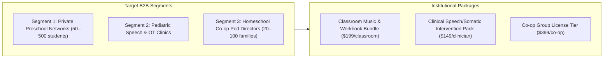

# 🏫 SOE B2B School & Pediatric Clinic Outreach Engine
**The Sound of Essentials: Rhythm Quest · Institutional & High-Ticket Licensing Playbook**

> **Target Markets:** Private Preschool Chains, Montessori/Waldorf Academies, Pediatric Speech-Language Pathology (SLP) & Occupational Therapy (OT) Clinics, Homeschool Co-op Alliances.
> **Commercial Objective:** Group licensing, classroom curriculum packs, and clinical intervention tool adoption.

---

## 1. Outreach Segment Matrix

---

## 2. Sequence 1: Private Preschool & Nursery Leadership

* **To:** Director of Curriculum · Head of Early Years · Preschool Principal
* **Target:** Private preschool networks, international nurseries, early childhood academies (US, UK, Canada, UAE)
* **Goal:** 15-minute curriculum walkthrough & sample classroom pack delivery

### Email 1.1: The Curriculum Differentiator
* **Subject A:** The music curriculum your families will talk about at pickup
* **Subject B:** Your preschool's next differentiator isn't another app—it's this
* **Preview Text:** A neuro-affirming early learning system spanning 7 developmental domains.

**Body:**
> Hi {{first_name}},
>
> Every private preschool promises "enrichment." Very few can deliver a structured, multi-sensory music and language curriculum without hiring a dedicated music specialist on staff.
>
> **The Sound of Essentials: Rhythm Quest** was engineered to solve that exact challenge.
>
> Crafted by a father's heart and a mother's love with an experienced educator, it is a complete, neuro-affirming early childhood system spanning 7 developmental domains: language, counting, movement, science, time, emotional regulation, and advanced vocabulary. Nineteen original master acoustic tracks, a 4,000+ word illustrated Picture Dictionary, and a structured daily workbook—all designed to run effortlessly with your existing classroom teachers.
>
> **Why preschool directors are adopting Rhythm Quest:**
> - **"Teacher-in-a-Box" Delivery:** No specialist music background required for classroom teachers.
> - **Calm by Design:** Low-stimulation, acoustic rhythm, zero screen dependency.
> - **Multilingual Scaffolding:** Available in English and French.
> - **Parent Attraction & Retention:** The kind of tangible, joyful learning parents notice on day one.
>
> I would love to send your curriculum team a complimentary **Classroom Sample Pack (Digital)** or schedule a brief 10-minute walkthrough this week.
>
> Would this Thursday or Friday afternoon work for a quick connection?
>
> Warm regards,  
> **Lee Murray**  
> Founder, *The Sound of Essentials*  
> `thesoundofessentials.com`

---

## 3. Sequence 2: Pediatric Speech & OT Clinics

* **To:** Clinical Director · Lead Speech-Language Pathologist · Pediatric Therapy Director
* **Target:** Pediatric speech therapy clinics, sensory processing OT practices, childhood neuro-developmental centers
* **Goal:** Clinical evaluation trial for multi-sensory rhythm interventions

### Email 2.1: The Rhythm-First Intervention Tool
* **Subject A:** A structured, calming intervention tool designed for the developing brain
* **Subject B:** When a child resists flashcards—try acoustic rhythm
* **Preview Text:** Neuro-affirming music and phonetic scaffolding for speech and OT sessions.

**Body:**
> Hi {{first_name}},
>
> As a pediatric therapist, you already know that rhythm is one of the brain's most fundamental organizing principles. Children with speech delays, ADHD, sensory processing differences, and autism often respond to rhythmic and auditory cues when traditional therapeutic flashcards fail to engage.
>
> **The Sound of Essentials: Rhythm Quest** was built specifically for this reality.
>
> It is a structured, sensory-friendly vocabulary and rhythm system—not an app, not a screen—that uses acoustic melody, repetition, and somatic movement to support phonological decoding, motor coordination, and self-regulation.
>
> **Clinically relevant features:**
> - **19 Original Tracks:** Structured phonetic call-and-response, rhythmic syllable segmentation, and calming breathing cues.
> - **4,000+ Word Illustrated Picture Dictionary:** Phonetic pronunciation guides ideal for speech-language scaffolding.
> - **Low-Stimulation Architecture:** ASMR-paced acoustic instruments, zero flashing screens, sensory-friendly tone.
> - **Modular 3-Minute Blocks:** Easily integrated into 30-minute clinical sessions.
>
> I would be delighted to provide your clinic with full complimentary digital access for clinical review.
>
> Could I send the access link and clinical overview sheet over to you today?
>
> Warmly,  
> **Lee Murray**  
> Founder, *The Sound of Essentials*  
> `thesoundofessentials.com`

---

## 4. Sequence 3: Homeschool Co-op & Pod Directors

* **To:** Homeschool Co-op Coordinator · Community Group Leader
* **Target:** Classical, Charlotte Mason, and Nature-Based Homeschool Co-ops (20–100 families)
* **Goal:** Co-op group license ($399) or bulk printed workbook orders

### Email 3.1: Complete Early Years Co-op Morning Routine
* **Subject A:** Open-and-go music & phonics curriculum for your co-op mornings
* **Subject B:** Group access to The Sound of Essentials for your co-op
* **Preview Text:** 16-minute morning rhythm covering 7 domains for ages 2 to 8.

**Body:**
> Hi {{first_name}},
>
> Organizing morning circle time and enrichment for 20+ mixed-age little learners (ages 2 to 8) can be challenging for co-op parent volunteers.
>
> **The Sound of Essentials: Rhythm Quest** provides an open-and-go, 16-minute daily learning routine that combines music, phonics, counting, and movement across 7 developmental lands.
>
> We offer **Co-op Community Licenses** that include:
> - Full digital streaming access to all 19 curriculum tracks for every family in your pod.
> - Printable multi-sensory workbook activities for 40 structured days.
> - Bulk printed workbook discounts for your co-op orders.
>
> You can preview the full 19-track album for free right now at `thesoundofessentials.com/listen`.
>
> If you'd like to test this with your co-op leadership for your upcoming semester, let me know and I'll send over a complete Co-op Evaluation Kit!
>
> Blessings,  
> **Lee Murray**  
> *The Sound of Essentials*
