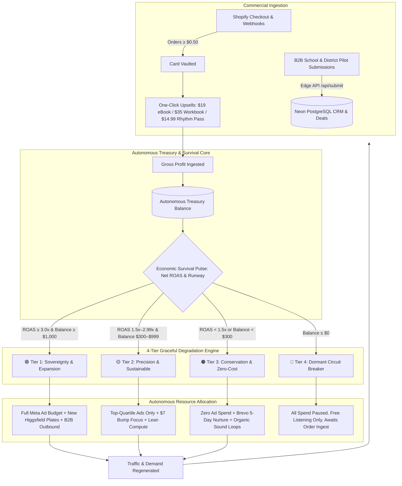

# 🔄 The Autonomous Demand Fusion Loop: Self-Sustaining Economic Architecture

> **Core Thesis:** Integrate the economic survival mechanics of autonomous AI agents (the "pay-for-compute-or-die" paradigm) into **The Sound of Essentials Demand Fusion Engine**. By binding creative generation, Meta ad spend, and email nurture into a closed-loop treasury governed by deterministic survival tiers, SOE creates a marketing system that scales aggressively when profitable, gracefully degrades when margins compress, and never runs an unmonitored loss.

---

## 1. Executive Context & Synthesis

### The Provocation: Ray Fu's Teardown of Automaton
In Conway Research's *Automaton* (analyzed by Ray Fu), an AI agent owns a stablecoin wallet, pays for its own inference, and shuts down if its balance reaches zero. 
As Ray Fu observed:
> *"13,000 agents opened wallets in 24 hours. Here is the number nobody has published: how many of them earned anything? An AI that dies when it runs out of money is just a server you forgot to pay for, unless it can do something people value enough to keep it alive."*

For an isolated agent with no real-world offering, survival pressure is a novelty. 

### The SOE Inversion: Real Products, Real Demand, Autonomous Discipline
SOE possesses the real-world commercial engine that Automaton lacked:
1. **Proven High-Converting Product Ladder:** Truly $0 front end (19-track album) → $7 in-cart card-vaulting bump → $19 flat eBook → $35 physical *Rhythm Ready Workbook* → $14.99/mo *Rhythm Pass* subscription.
2. **Shopify Post-Purchase Infrastructure:** Real card vaulting on orders ≥ $0.50 via the $7 bump, unlocking post-purchase one-click upsells.
3. **High-Value Enterprise B2B Market:** Stage 3 State DOE procurement, Head Start ELOF adoptions, and $349 classroom print crates.
4. **Rich Creative Asset Engine:** 30 ad archetypes, 5 Cultural Deltas, and the Higgsfield visual asset pipeline.

By wrapping this into a **Demand Fusion Loop**, we eliminate the fatal flaw of traditional digital marketing (unbounded ad spend, runaway agency/compute costs, and disconnected vanity metrics) and replace it with **a mathematically self-regulating revenue engine**.

---

## 2. Master System Architecture: The Closed-Loop Treasury



---

## 3. The 4 Survival Tiers (Graceful Degradation Protocol)

Instead of binary "running vs. crashed", the Demand Fusion Loop operates in **four dynamic economic states**. Transition between tiers is governed by deterministic rules in code:

| Tier | Economic Status | Trigger Conditions | Compute & Model Allocation | Marketing & Ad Operations | Creative Pipeline (Higgsfield) |
| :--- | :--- | :--- | :--- | :--- | :--- |
| **🟢 Tier 1: Sovereignty / Expansion** | High Margin & Abundant Treasury | **Net ROAS ≥ 3.0x** AND **Treasury Balance ≥ $1,000** | Frontier models (Claude 3.7 / GPT-4o) for high-level creative synthesis & B2B RFP bid crafting. | Full Meta ad scaling across all 5 testing waves; active retargeting; B2B district outbound. | Generate new master plates for unserved archetypes (e.g. Archetypes 21–30, 9:16 vertical reels). |
| **🟡 Tier 2: Precision / Sustainable** | Break-Even / Controlled Growth | **Net ROAS 1.50x–2.99x** OR **Treasury Balance $300–$999** | Hybrid: Low-cost models (Gemini Flash / Claude Haiku) for execution; frontier models for approvals only. | Prune bottom 50% of ad creatives. Double down strictly on high-vaulting Gate 1 ads (Ad 01, Ad 14). Emphasize $7 bump. | Freeze new plate generation; remix existing approved visual plates with fresh copy overlays. |
| **🟠 Tier 3: Conservation / Survival** | Margin Compression / Deficit Risk | **Net ROAS < 1.50x** OR **Treasury Balance < $300** | Ultra-lean: Local/cached models only. Minimal API inference tokens. | **IMMEDIATELY HALT ALL PAID AD SPEND.** Shift 100% to zero-marginal-cost demand channels (see Section 5). | Zero generative spend. Repurpose existing static assets for social and email. |
| **🔴 Tier 4: Dormant / Hibernation** | Zero Treasury | **Treasury Balance ≤ $0.00** | **Absolute Code Circuit Breaker.** Zero inference calls permitted. | All external API calls, paid campaigns, and broadcasts stopped. | Fully offline. |

> [!IMPORTANT]
> **The Hibernation Resilience Rule:** Tier 4 is never a fatal crash. Public-facing web assets (`/listen`, `/universe`, `/science`) remain operational and accessible. When an inbound customer completes a purchase on Shopify or an institution submits an order, the webhook instantly credits the treasury, waking the loop back into Tier 2 or Tier 1.

---

## 4. The Three Practical Implementations (Stolen from Ray Fu's Breakdown)

### 1. Cost-Aware Agent Telemetry
Agents must understand their exact cost per task and measure it against gross customer margin:
- Every generative asset run (Higgsfield, Remotion, LLM copy synthesis) calculates its unit cost and logs it to `crm_treasury_ledger`.
- If a marketing operation's estimated cost exceeds 15% of the expected front-end margin ($7 bump gross margin = ~$6.10), the loop requires explicit optimization or falls back to a cheaper execution tier.

### 2. Graceful Degradation in System Design
Most marketing setups either spend $100/day on ads or shut down completely. The Demand Fusion Loop builds **the resilient middle**:
- **Frontier Models** are reserved exclusively for:
  1. Strategic market positioning and Cultural Delta alignment.
  2. Synthesizing multi-wave ad campaign angles.
  3. High-ticket B2B institutional proposal drafting (State DOEs, Head Start).
- **Cheap / Flash Models** handle all mechanical pipeline work:
  1. Categorizing incoming contact form submissions.
  2. Formatting CSV imports and CRM record updates.
  3. Generating social caption variations from pre-approved master copy.

### 3. Hard Stops in Code, Never in the Prompt
An AI agent instructed via system prompt to "spend carefully" will always rationalize spending more money. 
- In the Demand Fusion Loop, daily spend limits, maximum drawdowns, and tier transitions are **enforced deterministically in JavaScript/TypeScript edge functions** (e.g. `web/functions/api/admin/crm/treasury.js`):
```javascript
// Hard Circuit Breaker (Deterministic Code)
if (treasuryBalance <= 0) {
  await pauseMetaCampaigns({ reason: 'TREASURY_DEPLETED' });
  await enterTier4Hibernation();
  return { status: 'HIBERNATING', message: 'Spend halted. Awaiting revenue deposit.' };
}
```

---

## 5. The Tier 3 Survival Engine: Zero-Marginal-Cost Demand Loops

When the loop drops into **Tier 3 (Conservation)**, it survives and repopulates the treasury through four organic engines that cost $0.00 in paid media:

### Loop 1: The Brevo 5-Day Nurture Engine
- Activates the established 5-day email nurture sequence for all unpurchased Gate 1 contacts.
- Day 1: Identity & Welcome → Day 2: The Acoustic Screen Alternative → Day 3: Harvard Neuroscience Proof → Day 4: The 10-Minute Daily Ritual → Day 5: The Full Quest Invitation.
- Directly converts stored email equity into $19 eBook and $35 *Rhythm Ready Workbook* purchases.

### Loop 2: The Short-Form Audio Virality Loop (Views >> Followers)
- Deploys organic TikTok and Instagram sound-bites using the 19-track album's highest-energy rhythmic hooks (*"Numbers"*, *"Drill Time"*, *"Le Cheval"*).
- Uses parent-relatable text overlays (*"When your 4-year-old learns skip counting before kindergarten"*).
- Drives organic traffic to the Gate 1 `/listen` page with zero ad spend.

### Loop 3: The Ally Annex Referral Multiplexer
- Promotes active partner offers in the Ally Annex (e.g. Mindvalley 50% commission, Hoffman Academy 20% recurring, Jai Institute $375–$475 per enrollment) to generated email segments.
- Affiliate commissions flow directly back into the treasury as pure operating fuel.

### Loop 4: Direct Stage 3 B2B Institutional Outreach
- Triggers targeted email sequences to public school Pre-K directors, Head Start coordinators, and private preschool directors using the *Turn-Key Classroom Lesson Extension* and *ELOF Crosswalk* assets.
- A single $349 classroom crate sale injects immediate runway back into the treasury.

---

---

## 6. Mathematical Unit Economics: Linear Paid Baseline vs. Exponential Virality

The Demand Fusion Loop is engineered to function under two distinct economic regimes: a conservative paid acquisition baseline and an **exponential organic sound virality engine**.

### 6.1 Conservative Paid Benchmark (Linear Baseline)
When relying solely on paid Meta ads ($0.80 CPC), the loop achieves positive unit economics on the front-end through the $7 in-cart card-vaulting bump and post-purchase stack:
- 100 Paid Visitors ($80 spend) → 20 Gate 1 Leads → 6 Vaulted Cards ($42) → Upsells ($60) = **$102 Front-End Gross ($1.275x ROAS)**.
- 60-day customer LTV climbs to **~$135 (1.68x Net ROAS)** with recurring Rhythm Pass retention.

### 6.2 The Exponential TikTok Virality Flywheel ($0 CAC & 88%–92% Net Margins)
When the 19 acoustic tracks propagate organically via short-form video ("Views >> Followers" on TikTok & Reels), acquisition costs drop to **$0.00**, and contribution margins expand exponentially:

```
┌──────────────────────────────────────────────────────────────────────────────────────────────────┐
│                          EXPONENTIAL VIRALITY MULTIPLIER SCENARIOS                               │
├───────────────────────────────┬────────────────────────┬───────────────────┬─────────────────────┤
│ Metric                        │ Scenario A (Steady)    │ Scenario B (Mid)  │ Scenario C (Mega)   │
├───────────────────────────────┼────────────────────────┼───────────────────┼─────────────────────┤
│ Monthly TikTok Audio Views    │ 250K–500K              │ 1.5M–3.0M         │ 8M–15M+             │
│ Monthly Gate 1 Email Unlocks  │ 5,000 leads            │ 24,000 leads      │ 120,000 leads       │
│ $7 Starter Pack Vaulted Cards │ 1,500 ($10,500)        │ 7,200 ($50,400)   │ 33,600 ($235,200)   │
│ $19 Rhythm Quest eBook Upsells│ 375 ($7,125)           │ 1,800 ($34,200)   │ 8,400 ($159,600)    │
│ $35 Rhythm Ready Print Books  │ 300 ($10,500)          │ 1,440 ($50,400)   │ 6,720 ($235,200)    │
│ $14.99/mo Rhythm Pass MRR     │ 180 ($2,698/mo)        │ 1,200 ($17,988/mo)│ 6,500 ($97,435/mo)  │
│ Stage 3 B2B Institutional     │ $3,490 (10 Crates)     │ $18,725 (Pilots)  │ $75,000 (Adoptions) │
├───────────────────────────────┼────────────────────────┼───────────────────┼─────────────────────┤
│ TOTAL MONTHLY REVENUE         │ **$34,313 / mo**       │ **$171,713 / mo** │ **$802,435 / mo**   │
│ Blended Net Contribution %    │ **87.8% Net Margin**   │ **89.2% Net Margin│ **91.5% Net Margin**│
│ NET MONTHLY PROFIT            │ **$30,118 / mo**       │ **$153,193 / mo** │ **$734,235 / mo**   │
│ ANNUALIZED RUN RATE           │ **$411K / year**       │ **$2.06M / year** │ **$9.63M / year**   │
└───────────────────────────────┴────────────────────────┴───────────────────┴─────────────────────┘
```

> [!TIP]
> **Complete Projections Specification:** For the exhaustive cohort analysis, bulk print pricing curves, and TikTok sound creator seeding playbooks, see [`docs/exponential_virality_projections.md`](file:///C:/Users/ldmur/Downloads/The-Sound-of-Essentials-Website/docs/exponential_virality_projections.md).

---

## 7. Implementation Roadmap: Embedding into SOE Infrastructure

1. **Step 1: Database Treasury Schema (`Neon PostgreSQL`)**
   - Create `crm_treasury_ledger` table tracking: `timestamp`, `transaction_type` (inbound_order, ad_spend, inference_cost), `amount`, `resulting_balance`, and `active_tier`.
2. **Step 2: Shopify Webhook Auto-Crediting (`/api/shopify-webhook`)**
   - On every order paid event, calculate gross profit and automatically post a credit transaction to `crm_treasury_ledger`.
3. **Step 3: Edge Circuit Breaker (`web/functions/api/admin/crm/treasury.js`)**
   - Provide an edge API endpoint returning `{ currentTier, treasuryBalance, canSpendPaidAds, inferenceTier }`.
4. **Step 4: Meta Marketing API Sync**
   - Connect the circuit breaker to pause or activate Meta Ad sets based on tier status.
5. **Step 5: Admin Dashboard Widget (`/admin/crm`)**
   - Add a real-time **Economic Vitality Gauge** on the SOE Command CRM dashboard displaying current treasury runway, active survival tier, and auto-pilot status.
