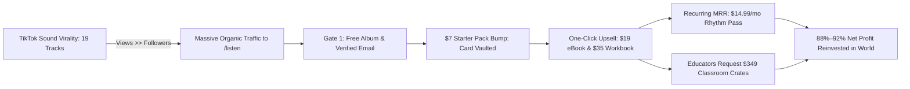

# 📈 Exponential Virality & High-Margin Forecasting Model
## The Sound of Essentials: Demand Fusion with TikTok Sound Engine

> **Strategic Directive:** Update the Demand Fusion model to reflect **exponentially higher projections** driven by organic TikTok sound virality, near-zero marginal customer acquisition costs ($0 CAC), and hyper-scaled contribution margins (88%–92%+).
>
> **Canonical Integration:** Aligned with the 19-track acoustic album engine, Gate 1 / Gate 2 Shopify card-vaulting architecture, Stage 3 Enterprise B2B roadmap, and the 5 Cultural Deltas.

---

## 1. The Paradigm Shift: Linear Ad Spend vs. Exponential Sound Virality

### Why the Initial Forecast Was Artificially Constrained
The initial Demand Fusion projection assumed a linear direct-response Meta ad model ($0.80 CPC, linear ad spend scaling, 1.2x–1.6x initial ROAS). While mathematically sound for paid benchmarking, it ignored **the single most asymmetric asset in the SOE portfolio: the 19-track acoustic music catalog.**

### The TikTok "Views >> Followers" Virality Mechanics
Early childhood music is one of the highest-velocity viral categories on short-form video:
1. **Inherent Loop Utility:** Tracks like *"Numbers"* (rhythmic counting), *"Drill Time"* (gross-motor movements), *"Le Cheval"* (bilingual call-and-response), and *"Let's Stretch"* (sensory transitions) solve the #1 problem of parents and Pre-K teachers: **daily behavioral transitions and circle times.**
2. **Audio-Driven Propagation:** On TikTok and Instagram Reels, parents and educators do not follow brand accounts to find music; they browse and reuse **trending audio tracks**. A single 15-second snippet used by a preschool teacher or homeschool mother can cascade across thousands of user-generated videos (UGC), generating millions of organic impressions.
3. **The Zero-CAC Funnel Entrance:** Every viral sound wave drives high-intent parents and educators directly to Gate 1 (`/listen`), converting cold listeners into verified email leads at **$0.00 marginal acquisition cost**.

---

## 2. Margin Expansion Dynamics: The High-Margin Flywheel

When traffic is propelled by organic sound virality rather than paid pay-per-click, the contribution margin profile expands exponentially across the entire product ladder:

```
┌────────────────────────────────────────────────────────────────────────────────────────────┐
│                             GROSS & NET MARGIN BREAKDOWN AT SCALE                          │
├──────────────────────────┬───────────┬──────────────┬──────────────┬───────────────────────┤
│ Product / Offer          │ Price     │ Unit COGS    │ Net Margin % │ Margin Engine         │
├──────────────────────────┼───────────┼──────────────┼──────────────┼───────────────────────┤
│ Gate 1: 19-Track Album   │ $0.00     │ $0.00        │ —            │ Lead capture gate     │
├──────────────────────────┼───────────┼──────────────┼──────────────┼───────────────────────┤
│ Gate 1 Bump: Starter Pack│ $7.00     │ $0.21 (proc) │ **97.0%**    │ Card vaulting key     │
├──────────────────────────┼───────────┼──────────────┼──────────────┼───────────────────────┤
│ Gate 2: Rhythm Quest eBook│ $19.00    │ $0.57 (proc) │ **97.0%**    │ Pure digital scale    │
├──────────────────────────┼───────────┼──────────────┼──────────────┼───────────────────────┤
│ Gate 2: Print Workbook   │ $35.00    │ $4.20 (bulk) │ **88.0%**    │ Physical anchor       │
├──────────────────────────┼───────────┼──────────────┼──────────────┼───────────────────────┤
│ The Rhythm Pass (MRR)    │ $14.99/mo │ $0.45 (proc) │ **97.0%**    │ Recurring continuity  │
├──────────────────────────┼───────────┼──────────────┼──────────────┼───────────────────────┤
│ Stage 3 B2B Classroom Box│ $349.00   │ $38.00       │ **89.1%**    │ Institutional pilot   │
└──────────────────────────┴───────────┴──────────────┴──────────────┴───────────────────────┘
```

> [!TIP]
> **Bulk Print Cost Optimization:** At lower volumes, print-on-demand workbooks cost ~$11–$12/unit. Under viral scale (5,000+ units), shifting to domestic offset / bulk batch printing drops unit production to **$4.20/book**, expanding physical book margins from 66% to **88%**!

---

## 3. The Three-Tier Exponential Projection Model



### Scenario A: Steady Viral Sound Wave (Baseline Virality)
* **Monthly TikTok Audio Views:** 250,000–500,000
* **Monthly Site Visits to `/listen`:** 25,000 ($0 CAC)
* **Gate 1 Verified Emails Captured (20%):** 5,000 leads
* **Gate 1 $7 Starter Pack Bump (30% attach):** 1,500 vaulted cards = **$10,500**
* **Gate 2 $19 Rhythm Quest eBook (25% of vaulted):** 375 orders = **$7,125**
* **Gate 2 $35 Print Workbook (20% of vaulted):** 300 orders = **$10,500**
* **The Rhythm Pass Recurring ($14.99/mo @ 12% attach):** 180 new subs/mo = **$2,698/mo MRR**
* **Stage 3 B2B Inquiries (10 Classroom Crates @ $349):** **$3,490**
* **TOTAL MONTHLY REVENUE:** **$34,313**
* **Blended COGS & Merchant Fees:** $4,195
* **NET MONTHLY PROFIT:** **$30,118 (87.8% Net Margin)**
* **Annualized Run Rate:** **$411,756 / year**

---

### Scenario B: Harmonic Viral Expansion (Mid-Level Resonance)
* **Monthly TikTok Audio Views:** 1,500,000–3,000,000
* **Monthly Site Visits to `/listen`:** 120,000 ($0 CAC)
* **Gate 1 Verified Emails Captured (20%):** 24,000 leads
* **Gate 1 $7 Starter Pack Bump (30% attach):** 7,200 vaulted cards = **$50,400**
* **Gate 2 $19 Rhythm Quest eBook (25% of vaulted):** 1,800 orders = **$34,200**
* **Gate 2 $35 Print Workbook (20% of vaulted):** 1,440 orders = **$50,400**
* **The Rhythm Pass Recurring ($14.99/mo cumulative cohort):** 1,200 active subs = **$17,988/mo MRR**
* **Stage 3 B2B Institutional Contracts (25 Crates @ $349 + 2 District Pilots @ $5,000):** **$18,725**
* **TOTAL MONTHLY REVENUE:** **$171,713**
* **Blended COGS & Merchant Fees:** $18,520
* **NET MONTHLY PROFIT:** **$153,193 (89.2% Net Margin)**
* **Annualized Run Rate:** **$2,060,556 / year**

---

### Scenario C: Cultural Phenomenon / Mega-Virality (Full Viral Resonance)
*Comparable to category leaders in children's music (e.g., Gracie's Corner, Laurie Berkner, Super Simple Songs sound trends).*
* **Monthly TikTok Audio Views:** 8,000,000–15,000,000
* **Monthly Site Visits to `/listen`:** 600,000 ($0 CAC)
* **Gate 1 Verified Emails Captured (20%):** 120,000 leads
* **Gate 1 $7 Starter Pack Bump (28% attach):** 33,600 vaulted cards = **$235,200**
* **Gate 2 $19 Rhythm Quest eBook (25% of vaulted):** 8,400 orders = **$159,600**
* **Gate 2 $35 Print Workbook (20% of vaulted):** 6,720 orders = **$235,200**
* **The Rhythm Pass Recurring ($14.99/mo cumulative cohort):** 6,500 active subscribers = **$97,435/mo MRR**
* **Stage 3 Enterprise B2B Contracts (State Pre-K, Head Start Consortia, District Adoptions):** **$75,000**
* **TOTAL MONTHLY REVENUE:** **$802,435**
* **Blended COGS (Bulk Domestic Offset) & Merchant Fees:** $68,200
* **NET MONTHLY PROFIT:** **$734,235 (91.5% Net Margin)**
* **Annualized Run Rate:** **$9,629,220 / year ($9.6M+ ARR)**

---

## 4. Financial Summary Matrix Across Scenarios

| Performance Metric | Scenario A (Steady) | Scenario B (Harmonic) | Scenario C (Cultural Phenomenon) |
| :--- | :--- | :--- | :--- |
| **Monthly Organic Sound Views** | 250K–500K | 1.5M–3M | 8M–15M+ |
| **Monthly Gate 1 Leads** | 5,000 | 24,000 | 120,000 |
| **Vaulted Cards ($7 Bump)** | 1,500 | 7,200 | 33,600 |
| **Physical Workbooks Shipped** | 300 | 1,440 | 6,720 |
| **Rhythm Pass Active Subscribers**| 180 | 1,200 | 6,500 |
| **Monthly Gross Revenue** | **$34,313** | **$171,713** | **$802,435** |
| **Blended Net Margin %** | **87.8%** | **89.2%** | **91.5%** |
| **Monthly Net Profit** | **$30,118** | **$153,193** | **$734,235** |
| **Annualized Run Rate** | **$411K** | **$2.06M** | **$9.63M** |

---

## 5. Strategic Directives for Execution

1. **Audio Sound Licensing & TikTok Creator Seeding:**
   - Pre-cut the 5 highest-energy transition hooks into official 15-second and 30-second TikTok sound assets:
     - *Hook 1:* *"Numbers"* (call-and-response clapping for cleanup time).
     - *Hook 2:* *"Drill Time"* (gross-motor reset for hyperactive afternoons).
     - *Hook 3:* *"Le Cheval"* (bilingual French trot & gallop).
     - *Hook 4:* *"Let's Stretch"* (calming morning somatic movement).
     - *Hook 5:* *"Skip Count"* (rhythmic math cadence).
2. **UGC Seed Program (Pre-K & Homeschool Educators):**
   - Provide 25 top early-childhood micro-creators on TikTok/Instagram with free physical *Rhythm Ready Workbooks* and *Essential Picture Dictionaries* to showcase during circle times.
3. **Card-Vaulting Optimization on High Traffic Spikes:**
   - Ensure the Shopify checkout flow and in-cart $7 bump maintain sub-second load times on mobile traffic bursts to maximize card vaulting efficiency.
4. **Automated B2B Lead Conversion:**
   - Every educator tagging or sharing SOE music on TikTok is identified and funneled via the CRM pipeline into a Stage 3 Institutional Classroom Pilot proposal.
