# 🚀 SOE Meta Campaign Master Deployment Blueprint
### The Sound of Essentials: Rhythm Quest · Meta Ads Engine (Wave 1 & Wave 2)
> Sourced directly from visual assets in `C:\Users\ldmur\Downloads\The Sound of Essentials Image Assets\Meta ad mocks`  
> Built for: Meta Ads Manager (Facebook & Instagram Feed, Stories, Reels)  
> Core Funnel: `/listen` (Gate 1 Free 19-Track Album) → 5-Day Nurture → `/rhythm-ready` ($21 Ebook / $35 Print)

---

## 1. Campaign Structure & Budget Strategy

```mermaid
flowchart TD
    subgraph C1["CAMPAIGN 1: COLD ACQUISITION (CBO / Advantage+ Budget)"]
        direction TB
        B1["Budget: $25.00 / day"]
        S1["Ad Set 1: Homeschool & Alternative Ed (Interest Stack)"]
        S2["Ad Set 2: Early Childhood Educators (NAEYC / Pre-K / K-2)"]
        S3["Ad Set 3: Screen-Free & Mindful Parenting (Montessori / Waldorf)"]
        B1 --> S1 & S2 & S3
    end

    subgraph C2["CAMPAIGN 2: WARM RETARGETING (ABO)"]
        direction TB
        B2["Budget: $10.00 / day"]
        R1["Ad Set 4: Visited /listen (No Opt-in) — 30 Days"]
        R2["Ad Set 5: Opted-In (Gate 1 Unlocked, No Workbook Buy) — 60 Days"]
        B2 --> R1 & R2
    end

    subgraph C3["CAMPAIGN 3: GLOBAL CONCORD & BILINGUAL"]
        direction TB
        B3["Budget: $10.00 / day"]
        G1["Ad Set 6: Bilingual EN/ES & French Immersion Pods (US / LatAm / Canada)"]
        B3 --> G1
    end

    subgraph C4["CAMPAIGN 4: GLOBAL ESL — LEARN ENGLISH"]
        direction TB
        B4["Budget: $15.00 / day"]
        E1["Ad Set 7: Global ESL Parents (LatAm, Asia, Middle East, Europe)"]
        B4 --> E1
    end

    style C1 fill:#E3F2FD,stroke:#1565C0,stroke-width:2px
    style C2 fill:#FFF3E0,stroke:#FF6F00,stroke-width:2px
    style C3 fill:#F3E5F5,stroke:#7B1FA2,stroke-width:2px
    style C4 fill:#E8F5E9,stroke:#2E7D32,stroke-width:2px
```

### 🌟 Core Campaign Slogans:
- *"The Sound of Essentials has found you."*
- *"Made in the land of America."*
- *"The Essentials of Learning."*
- *"Responsibility with Tech — teaching through tried-and-true systems."*
- *"Staying on the path, always learning."*

---

## 2. Audience Targeting Specifications

### 🎯 Ad Set 1: Homeschooling & Self-Directed Education (Cold)
* **Locations:** United States, Canada, United Kingdom, Australia
* **Age:** 24 – 48 | **Gender:** All (skews Female 72%)
* **Placements:** Advantage+ Placements (FB Feed, IG Feed, IG Stories, FB Reels)
* **Detailed Targeting (Interests - Match ANY):**
  * Homeschooling · Charlotte Mason education · Classical education · Unschooling · Home School Legal Defense Association (HSLDA) · The Well-Trained Mind
* **Exclusions:** Existing Website Leads / Customer List
* **Optimization Goal:** Leads (`Lead` event on `/listen`)

### 🎯 Ad Set 2: Early Literacy Educators & Specialists (Cold)
* **Locations:** United States (National)
* **Age:** 25 – 55 | **Gender:** All
* **Detailed Targeting (Demographics & Interests):**
  * Job Titles: Kindergarten Teacher, Preschool Teacher, Early Childhood Educator, Reading Specialist, Speech-Language Pathologist
  * Interests: National Association for the Education of Young Children (NAEYC), Early childhood education, Phonological awareness, Orton-Gillingham
* **Optimization Goal:** Leads (`Lead` event on `/listen`)

### 🎯 Ad Set 3: Screen-Free & Sensory Stewardship Parents (Cold)
* **Locations:** United States
* **Age:** 24 – 42
* **Detailed Targeting (Interests - Match ANY):**
  * Screen-Free Parenting · Waldorf education · Montessori education · Nature-based preschool · Positive parenting · Attachment parenting · ASMR / Calm kids
* **Optimization Goal:** Leads (`Lead` event on `/listen`)

### 🎯 Ad Set 4: Retargeting — Landing Visitors (Warm)
* **Custom Audience:** All visitors to `thesoundofessentials.com` (Past 30 Days)
* **Exclusions:** `Lead` event / Customers
* **Optimization Goal:** Leads (`Lead`)

### 🎯 Ad Set 5: Retargeting — Gate 1 Album Owners (Hot)
* **Custom Audience:** `Lead` event / `/listen?unlocked=true` visitors (Past 60 Days)
* **Exclusions:** Completed Purchases (`InitiateCheckout` / Customers)
* **Target Offer:** $21 Rhythm Ready Workbook
* **Optimization Goal:** Initiate Checkout (`InitiateCheckout`)

---

## 3. Creative Inventory & Ad Copy Engine (Mapped to `Meta ad mocks`)

All primary text hooks are strictly engineered to front-load the punchline within Meta’s **125 visible character limit** before the “...See more” truncation.

---

### Creative #1: "The Enemy" / Before-After-Bridge
* **Asset File:** `Ad7_Before_After_Bridge.png`
* **Cultural Delta:** Δ1 (Screen vs. Sensory)
* **Headline:** Screen Time You Won't Feel Bad About
* **Description:** 100% Free • Instant Access
* **CTA Button:** `LISTEN_NOW`
* **Destination URL:** `https://thesoundofessentials.com/listen?utm_source=meta&utm_medium=paid_social&utm_campaign=cold_delta1&utm_content=ad7_before_after`

#### Primary Text Variations:
* **Hook A (Guilt Shift):**
  > Tired of kids' content that feels like junk food for the developing brain? (74 chars)
  >
  > The flashing neon cuts and hyperactive loops are engineered to hook eyes — not nurture minds.
  >
  > The Sound of Essentials: Rhythm Quest is the anti-Cocomelon. 19 calm, acoustic songs that teach phonics, counting, science, and emotional regulation.
  >
  > 🎵 Stream the full 19-track album 100% free today.
* **Hook B (Sensory Focus):**
  > When the screen turns off, does your child melt down? That’s algorithmic overstimulation. (89 chars)
  >
  > Rhythm Quest uses acoustic tempo, real instruments, and sound-before-symbol phonics to ground early learners.
  >
  > Free instant access for your family below.

---

### Creative #2: "What They Took" (The Lost Music Program)
* **Asset File:** `Ad2_What_They_Took.png`
* **Cultural Delta:** Δ2 (Testing vs. Arts)
* **Headline:** When Schools Cut Music, We Built This
* **Description:** 19 Tracks • 7 Lands • Free
* **CTA Button:** `LEARN_MORE`
* **Destination URL:** `https://thesoundofessentials.com/listen?utm_source=meta&utm_medium=paid_social&utm_campaign=cold_delta2&utm_content=ad2_what_they_took`

#### Primary Text Variations:
* **Hook A (Classroom Injustice):**
  > They called music "non-essential" because it wasn't on the standardized test. (76 chars)
  >
  > So, guided by a father's heart and a mother's love, they sat down and built what the schools took away.
  >
  > 19 songs. 7 developmental lands. 15 hero mentors. A complete early learning curriculum where music and literacy are the exact same lesson.
  >
  > 🎧 Built for the developing brain, not the algorithm. Start free.
* **Hook B (Pedagogy Proof):**
  > Brain science proved rhythm accelerates reading fluency. Then schools cut the music budget. (92 chars)
  >
  > We brought it home. Discover the 7 Lands of Rhythm Quest — free 19-track album access today.

---

### Creative #3: "The Other Side" (Us vs. Them)
* **Asset File:** `Ad4_The_Other_Side.png`
* **Cultural Delta:** Δ5 (Consumption vs. Quest)
* **Headline:** Replace Junk Content With This
* **Description:** 5 Developmental Domains
* **CTA Button:** `LISTEN_NOW`
* **Destination URL:** `https://thesoundofessentials.com/listen?utm_source=meta&utm_medium=paid_social&utm_campaign=cold_delta5&utm_content=ad4_the_other_side`

#### Primary Text Variations:
* **Hook A (Contrast):**
  > Most kids' media wants your child staring. Rhythm Quest wants your child singing and moving. (91 chars)
  >
  > Turn morning car rides and quiet time into an 8-week learning quest.
  >
  > Language, math, science, and somatic movement wrapped in warm orchestral melodies. Free album + coloring pages.

---

### Creative #4: "The Name Tells You Everything"
* **Asset File:** `Ad5_The_Name.png`
* **Cultural Delta:** Δ4 (Institution vs. Sanctuary)
* **Headline:** Built for Brains, Not Algorithms
* **Description:** A parent's mission for kids
* **CTA Button:** `LISTEN_NOW`
* **Destination URL:** `https://thesoundofessentials.com/listen?utm_source=meta&utm_medium=paid_social&utm_campaign=cold_delta4&utm_content=ad5_the_name`

#### Primary Text Variations:
* **Hook A (Origin Truth):**
  > Why is it called The Sound of Essentials? Because early rhythm is not an elective. (83 chars)
  >
  > It’s the neurological foundation of how children decode words, understand patterns, and regulate emotions.
  >
  > Join 1,000+ families listening to the 19-track album free.

---

### Creative #5: "The Victory Garden" (Sanctuary Home)
* **Asset File:** `Ad6_Victory_Garden.png`
* **Cultural Delta:** Δ4 (Institution vs. Sanctuary)
* **Headline:** Your Living Room Is the Classroom
* **Description:** 16 mins/day • Zero burnout
* **CTA Button:** `LISTEN_NOW`
* **Destination URL:** `https://thesoundofessentials.com/listen?utm_source=meta&utm_medium=paid_social&utm_campaign=cold_delta4&utm_content=ad6_victory_garden`

#### Primary Text Variations:
* **Hook A (Sanctuary Empowerment):**
  > You don't need a four-hour homeschool grind. You need 16 minutes of intentional rhythm. (88 chars)
  >
  > Discover the calm, multi-sensory learning system that turns breakfast into joyful reading and counting practice.
  >
  > Tap to unlock all 19 tracks free.

---

### Creative #6: "The Trojan Horse" (Play as Literacy Engine)
* **Asset File:** `Ad9_Trojan_Horse.png`
* **Cultural Delta:** Δ3 (Algorithm vs. Handcrafted)
* **Headline:** Free Music That Teaches Kids
* **Description:** Phonics, Math & Science
* **CTA Button:** `LISTEN_NOW`
* **Destination URL:** `https://thesoundofessentials.com/listen?utm_source=meta&utm_medium=paid_social&utm_campaign=cold_delta3&utm_content=ad9_trojan_horse`

#### Primary Text Variations:
* **Hook A (Trojan Play):**
  > They think they’re just singing along. Their brain is mastering syllable segmentation. (87 chars)
  >
  > Rhythm is the brain's secret backdoor to reading readiness.
  >
  > Experience 19 masterfully produced tracks spanning 7 Lands. 100% free download.

---

### Creative #7: "The Public Announcement" (Podium Presser)
* **Asset File:** `Blank Podium SOE Presser.png`
* **Cultural Delta:** Δ4 (Institution vs. Sanctuary) / High Authority
* **Headline:** Early Learning Deserves Better
* **Description:** Official Parent Briefing
* **CTA Button:** `LEARN_MORE`
* **Destination URL:** `https://thesoundofessentials.com/listen?utm_source=meta&utm_medium=paid_social&utm_campaign=cold_presser&utm_content=ad_podium_presser`

#### Primary Text Variations:
* **Hook A (Pattern Interrupt):**
  > Official announcement to parents: Childhood learning no longer belongs to big tech algorithms. (95 chars)
  >
  > We engineered a calm, music-powered sanctuary for ages 2 to 8. 19 songs. 7 Lands. Zero screens required.
  >
  > See why educators and parents are switching to Rhythm Quest.

---

### Creative #8: "Direct Value Offer" (Album Cover Hero)
* **Asset File:** `Free_Music_.jpeg_202607121145.jpeg`
* **Cultural Delta:** Direct Offer / Gate 1
* **Headline:** 19 Free Educational Songs + Art
* **Description:** Ages 2–8 • Instant Access
* **CTA Button:** `LISTEN_NOW`
* **Destination URL:** `https://thesoundofessentials.com/listen?utm_source=meta&utm_medium=paid_social&utm_campaign=cold_direct&utm_content=ad_free_album_cover`

#### Primary Text Variations:
* **Hook A (Zero Friction):**
  > Unlock all 19 tracks of the Deluxe Rhythm Quest album + printable coloring sheets for free. (90 chars)
  >
  > No subscription required. Just rich, beautiful learning music for your family.
  >
  > Tap below for instant access.

---

### Creative #9: "Le Cheval Bilingual Wonder"
* **Asset File:** `Horses_Interlude_4_2K_202607121249.jpeg`
* **Cultural Delta:** Multilingual & Cultural Concord
* **Headline:** French Phonics Made Playful
* **Description:** Track 5 • Free Song & Video
* **CTA Button:** `LISTEN_NOW`
* **Destination URL:** `https://thesoundofessentials.com/listen?utm_source=meta&utm_medium=paid_social&utm_campaign=cold_bilingual&utm_content=ad_le_cheval`

#### Primary Text Variations:
* **Hook A (Bilingual Charm):**
  > Introduce your child to the elegance of French language and movement with 'Le Cheval'. (87 chars)
  >
  > A bilingual journey from the land of Luminosity that teaches vocabulary through song and posture.
  >
  > Stream free now.

---

### Creative #10: "The Morning Table Routine" (Retargeting Offer)
* **Asset File:** `SOE_on_table.jpeg_202607121145.jpeg`
* **Cultural Delta:** Retargeting / Gate 2 Ascension
* **Headline:** The 16-Minute Daily Workbook ($21)
* **Description:** 40 Days • Grades K–3
* **CTA Button:** `SHOP_NOW`
* **Destination URL:** `https://thesoundofessentials.com/rhythm-ready?utm_source=meta&utm_medium=paid_social&utm_campaign=retarget_warm&utm_content=ad_table_workbook`

#### Primary Text Variations:
* **Hook A (Routine Solution):**
  > Love the 19 free songs? Bring them to life with the 8-Week Rhythm Ready Workbook. (83 chars)
  >
  > 40 days of open-and-go morning lessons in phonics, math, science, and somatic movement.
  >
  > Just $21 for the complete digital curriculum (about 52¢ a day). Instant digital access.

---

## 4. Daily KPI Benchmarks & Optimization Rules

| Metric | Target Benchmark | Action If Below | Action If Above |
|---|---|---|---|
| **Link CTR** | **> 1.50%** | Refresh hook / Test new thumbnail visual | Scale ad spend +20% |
| **Cost Per Click (CPC)** | **< $1.40** | Broaden audience targeting | Maintain budget |
| **Gate 1 Opt-In Rate** | **> 28%** | Audit mobile CTA & form friction | Push higher top-of-funnel spend |
| **Cost Per Lead (CPL)** | **< $4.50** | Test Hook A vs Hook B | Prime scaling phase |
| **Tripwire Conversion** | **> 6.5%** | Test workbook price anchor on thank-you | Launch retargeting catalog |
