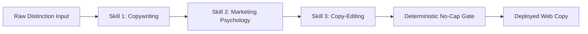

# Website Copy Ecosystem Distinction & 3-Skill Pipeline Implementation Plan

> **For Claude / Antigravity:** REQUIRED SUB-SKILL: Use `superpowers:executing-plans` (or structured task-by-task execution) to implement this plan.

**Goal:** Update all website copy across the React web application with the canonical distinction between the Album (*The Sound of Essentials: A Musical Learning Experience*) and the Companion Storybook (*The Sound of Essentials: Rhythm Quest*), enforcing strict "heroes" terminology, foundational axioms, and running every block through our 3 copy skills (`copywriting`, `marketing-psychology`, `copy-editing`).

**Architecture:** We use a synchronized multi-layer architecture:
1. **Locale Core (`en.json`, with downstream i18n parity)**: Centralized strings for the homepage hero, quest offer, features, comparison, and FAQ.
2. **Product Catalog Data (`products.json`)**: Authoritative SKU definitions, names, and descriptions for the Album, Storybook, Workbook, and Picture Dictionary.
3. **Component & Page Layer (`Home.jsx`, `Listen.jsx`, `RhythmQuestSale.jsx`, `Mission.jsx`, `Science.jsx`, `ExpandableGallery.jsx`)**: Inline copy, microcopy, ARIA labels, and feature badges.
4. **Deterministic Gatekeeper (`verify_website_copy_nocap.py`)**: Automated verification testing all 11 gates before marking complete.

**Tech Stack:** React 19, Vite 7, `react-i18next`, JSON data models, Python 3 validation harness.

---

## The 3-Skill Review & Polish Pipeline

Every section of copy will pass through a dedicated 3-skill gauntlet before approval:



### 1. Skill 1: `copywriting` (Conversion Architecture & Framing)
- **Primary Objective**: Clarify the value proposition and commercial ascension.
- **The Core Distinction**:
  - **Lead Hook**: *The Sound of Essentials: A Musical Learning Experience* (19 acoustic tracks) is gifted 100% free ($0) to founding families as our evergreen front door.
  - **The Commercial Pitch**: Experience the music first. Then pair that musical experience with the companion storybook—*The Sound of Essentials: Rhythm Quest* ($19)—to introduce the 15 heroes on the page and continue the legacy into physical workbooks ($35) and picture dictionaries.
- **CTA Optimization**: Replace vague buttons with high-intent action copy (*"Start the Free Experience →"*, *"Get the Companion Storybook ($19) →"*).

### 2. Skill 2: `marketing-psychology` (Behavioral Triggers & Sanctuary Framing)
- **Parental Identity Framing**: Speak directly to the "Sanctuary Parent" exhausted by screen-time meltdowns and algorithmic dopamine loops.
- **Sensory Grounding**: Ground copy in physical reality—warm acoustic arrangements recorded live, unhurried tempos, sitting together on the couch.
- **The Equitable Exchange**: Frame the purchase not as an aggressive extraction or commercial trap, but as a fair, willing exchange where families receive the music with gladness and choose to endeavor deeper into physical books.
- **Loss Aversion & Cognitive Ease**: Reassure parents that there are zero subscription traps or autoplay hooks—just pure, screen-free peace.

### 3. Skill 3: `copy-editing` (The 7-Sweep Polish & Anti-AI Audit)
- **Sweep 1 (Clarity)**: Eliminate run-on sentences, ambiguous phrasing, and insider jargon.
- **Sweep 2 (Voice & Tone)**: Ensure warm, dignified, and loving cadence (*"a father's heart and a mother's love"*).
- **Sweep 3 (So What?)**: Bridge every feature into a direct family outcome.
- **Sweep 4 (Prove It)**: Ground claims in peer-reviewed neuroscience (*Nature Scientific Reports*, auditory cortex wiring before age 7).
- **Sweep 5 (Specificity)**: Concrete numbers: 19 tracks, 7 Lands, 15 heroes, Ages 2–7.
- **Sweep 6 (Heightened Emotion)**: Evoke the quiet sigh of relief when living room battles turn into shared song.
- **Sweep 7 (Zero Risk)**: Clear guarantee and transparent pricing.
- **Anti-AI Policy**: Remove buzzwords (*"streamline"*, *"unlock potential"*, *"in today's fast-paced world"*). Enforce strict "heroes" terminology (purging all "characters").

---

## Detailed Before & After Copy Matrix

### Section A: Homepage Hero Offer (`web/src/i18n/locales/en.json` -> `home.hero_offer`)
* **Role**: Lead Hook (The Free Evergreen Front Door)
* **Skill 1 (`copywriting`)**: Focus entirely on experiencing the 19-track album freely.
* **Skill 2 (`marketing-psychology`)**: Emphasize sensory sanctuary, calming tempos, and zero screen fatigue.
* **Skill 3 (`copy-editing`)**: Crisp, active verbs, zero AI-isms.

```diff
- "eyebrow": "THE SOUND OF ESSENTIALS DELUXE · AGES 2–7",
- "title_main": "A Musical Learning Experience",
- "title_highlight": "(Free Today)",
- "subtitle": "An immersive audio journey through phonics, numbers, movement, and the natural world. Crafted for the developing brain—not the screen algorithm.",
+ "eyebrow": "FOUNDING FAMILY GIFT · AGES 2–7",
+ "title_main": "The Sound of Essentials: A Musical Learning Experience",
+ "title_highlight": "(Free Album)",
+ "subtitle": "Replace screen-time battles with 19 unhurried acoustic songs designed for the developing brain. Gifted freely to founding families—experience the music before pairing it with our companion storybook.",
- "check_1": "19 original songs that teach phonics, math & science",
+ "check_1": "19 original acoustic tracks that wire early phonics, math & emotional calm",
- "check_4": "100% Free Album Access · Instant Email Delivery",
+ "check_4": "100% Free Forever · No Subscription Trap · Pairs with Rhythm Quest",
- "cta_primary": "Start the Free Experience →",
+ "cta_primary": "Claim Your Free 19-Track Album →",
- "cta_secondary": "Explore The Seven Land Quest ($19) →",
+ "cta_secondary": "Pair With the Companion Storybook ($19) →"
```

---

### Section B: Homepage Quest Offer (`web/src/i18n/locales/en.json` -> `home.quest_offer`)
* **Role**: The Commercial Pitch (The Companion Storybook)
* **Skill 1 (`copywriting`)**: Frame as the essential visual/tactile companion that introduces the 15 heroes.
* **Skill 2 (`marketing-psychology`)**: Turn passive listening into an active heroic quest with tangible pages.
* **Skill 3 (`copy-editing`)**: Purge "characters" in favor of "heroes", sharpen benefit phrasing.

```diff
- "label": "The Illustrated Companion Storybook",
- "title_1": "Rhythm Quest",
- "title_2": "Storybook ($19)",
- "subtitle": "The full-color illustrated storybook that brings the music to life. Journey with Seriphia across all 7 Lands, meet the 15 Hero Mentors, and read along with every song.",
+ "label": "The Illustrated Companion Storybook",
+ "title_1": "The Sound of Essentials:",
+ "title_2": "Rhythm Quest ($19)",
+ "subtitle": "Experience the music, then bring the story home. This full-color companion storybook introduces our 15 lovable heroes across 7 lands, turning your family's listening journey into an active, tactile quest on the page.",
- "feat_2_title": "Full-Color Storybook Adventure",
- "feat_2_desc": "Rich hand-crafted storybook art, character backstories, and in-world foundational lore.",
+ "feat_2_title": "Meet the 15 Heroes",
+ "feat_2_desc": "Rich hand-crafted art and backstories for all 15 heroes, modeling kindness, patience, and phonics.",
- "feat_3_title": "Lyrics & Read-Along Sing-Alongs",
- "feat_3_desc": "Complete lyrics, phonetic cues, and dialogue for all 19 tracks so children can read as they listen.",
+ "feat_3_title": "Read-Along Sound-Before-Symbol Pedagogy",
+ "feat_3_desc": "Complete lyrics and phonetic cues for all 19 album tracks so children connect sounds to words naturally.",
- "cta": "Get the Rhythm Quest Storybook ($19) →"
+ "cta": "Pair With the Rhythm Quest Storybook ($19) →"
```

---

### Section C: Homepage Comparison & FAQ (`web/src/i18n/locales/en.json` -> `comparison` & `faq`)
* **Skill 1 & 2 (`copywriting` + `marketing-psychology`)**: Honest, transparent explanation of why the album is free and how the companion storybook/workbooks continue the legacy.
* **Skill 3 (`copy-editing`)**: Strict "heroes" nomenclature and removal of any outdated copy.

```diff
- "row_2_soe": "Cohesive 7 Lands & 15 Hero mentors",
+ "row_2_soe": "Cohesive 7 Lands & 15 Lovable Heroes in the companion storybook",
- "q1": "Why is The Sound of Essentials Deluxe completely free?",
- "a1": "The original Sound of Essentials was created as a whole-heart gift to families. The Deluxe edition remains free so every child has access to foundational sensory and musical learning. Instant digital access requires only an email, with optional learning materials and physical editions available at checkout.",
+ "q1": "Why is the album 100% free?",
+ "a1": "We believe foundational sensory learning is a birthright, not a luxury. That is why the complete 19-track album, The Sound of Essentials: A Musical Learning Experience, is gifted freely to founding families ($0) as our front door. Our commercial pitch is simple and honest: experience the music in your home first. When you are ready to expand the journey, you can pair the music with our physical companion storybook, The Sound of Essentials: Rhythm Quest ($19), and our tactile print workbooks.",
- "q5": "What is The Seven Land Quest ($19)?",
- "a5": "The Seven Land Quest is our comprehensive 7-week guided learning companion. It expands the 19 songs into 400 interactive activities, physical movement games, printable adventure maps, and weekly rhythm milestones.",
+ "q5": "What is the Rhythm Quest Companion Storybook ($19)?",
+ "a5": "The Sound of Essentials: Rhythm Quest is the official 66-page companion storybook that pairs with the album. It introduces our 15 heroes across all 7 Lands, provides read-along lyrics for all 19 tracks, and anchors early literacy through sound-before-symbol exploration."
```

---

### Section D: Product Data Synchronization (`web/src/data/products.json`)
* **Skill 1 & 3 (`copywriting` + `copy-editing`)**: Ensure product titles, short names, and descriptions reflect exact canon:

```diff
- "name": "The Sound of Essentials Deluxe: A Musical Learning Experience",
- "shortName": "The Sound of Essentials Deluxe",
+ "name": "The Sound of Essentials: A Musical Learning Experience",
+ "shortName": "A Musical Learning Experience",
  "price": 0.0,
- "description": "19 original tracks designed for the developing brain...",
+ "description": "The complete 19-track foundational album gifted freely to founding families ($0). Recorded live in studio sessions with warm vocals and unhurried acoustic arrangements to replace screen fatigue with calm co-regulation. Pairs with the Rhythm Quest companion storybook.",

- "name": "The Sound of Essentials: Rhythm Quest",
- "shortName": "Rhythm Quest",
+ "name": "The Sound of Essentials: Rhythm Quest (Companion Storybook)",
+ "shortName": "Rhythm Quest Companion Storybook",
  "price": 19.0,
- "description": "The 66-page illustrated companion story to the free 19-track album. Seriphia guides Kenji, Aiko, and the heroes through all 7 Lands...",
+ "description": "The official 66-page illustrated companion storybook that brings the 19-track album to life. Introduces all 15 heroes across 7 Lands, modeling phonemic awareness, kindness, and self-regulation on the page."
```

---

### Section E: Supporting Components & Pages
1. **`web/src/pages/Listen.jsx`**:
   - Subtitle: Add light reference: *"Experience the music first. Pair with the Rhythm Quest companion storybook ($19) to meet all 15 heroes on the page."*
   - Change button text: *"🎧 Launch 19-Track Album Player →"*.
   - Replace any lingering "characters" in modals/prompts.
2. **`web/src/components/AnimatedShaderHero.jsx`**:
   - Replace: `Fourteen brave characters` ➔ `Fourteen brave heroes`.
   - Replace: `15 Characters · 7 Lands` ➔ `15 Heroes · 7 Lands`.
3. **`web/src/components/ExpandableGallery.jsx`**:
   - Replace: `15 characters, each with a unique rhythm` ➔ `15 heroes, each with a unique rhythm`.
4. **`web/src/pages/Home.jsx`**:
   - Update carousel button: `aria-label="Next heroes"`.
   - Update info strip: `🦸 15 Heroes · 🗺️ 7 Musical Lands · 🎵 19 Acoustic Songs · 📚 Ages 2–7`.

---

## Step-by-Step Task Breakdown

### Task 1: Update Primary English Locale (`web/src/i18n/locales/en.json`)
- **Files**: `c:\Users\ldmur\Downloads\The-Sound-of-Essentials-Website\web\src\i18n\locales\en.json`
- **Actions**:
  - Update `home.hero_offer` with correct album title and pairing invitation.
  - Update `home.quest_offer` with companion storybook framing and 15 heroes.
  - Update `home.comparison` and `home.faq` with the equitable exchange and commercial pitch.
  - Purge all instances of "characters" across the file.

### Task 2: Update Product Catalog Data (`web/src/data/products.json`)
- **Files**: `c:\Users\ldmur\Downloads\The-Sound-of-Essentials-Website\web\src\data\products.json`
- **Actions**:
  - Update `rhythm-quest-album` name to *The Sound of Essentials: A Musical Learning Experience* ($0).
  - Update `rhythm-quest-ebook` to *The Sound of Essentials: Rhythm Quest (Companion Storybook)* ($19).
  - Update descriptions to explicitly state that the storybook pairs with the album.

### Task 3: Update React Components & Page Microcopy
- **Files**:
  - `web/src/pages/Home.jsx`
  - `web/src/pages/Listen.jsx`
  - `web/src/components/AnimatedShaderHero.jsx`
  - `web/src/components/ExpandableGallery.jsx`
- **Actions**:
  - Update ARIA labels, info strips, and button text to enforce "heroes" nomenclature.
  - Weave the light commercial pitch ("Experience the music, pair with the storybook") into the Listen page hero.

### Task 4: Run Deterministic Verification Harness
- **Files**: Create and execute `c:\Users\ldmur\Downloads\The-Sound-of-Essentials-Website\scripts\verify_website_copy_nocap.py`
- **Actions**:
  - Gate 1: Album title (*The Sound of Essentials: A Musical Learning Experience*) present.
  - Gate 2: Companion Storybook title (*The Sound of Essentials: Rhythm Quest*) present.
  - Gate 3: "Heroes" nomenclature strictly enforced (0 occurrences of "character" in user-facing copy).
  - Gate 4: "Father's heart and mother's love" paired.
  - Gate 5: "Music is the beacon for all children to learn" verified.
  - Gate 6: Strict Ages 2–7 (no Grade 3 / age 8+).
  - Gate 7: Commercial pairing pitch verified.
  - Gate 8: Pricing economics validated ($0 Album, $19 Storybook, $21/$35 Workbook).

### Task 5: Build Verification
- **Command**: `npm run build` in `web/` to guarantee zero JSX syntax or compilation errors.

---

## Execution Recommendation

Plan is saved and ready for review.

Would you like me to proceed with implementing **Task 1 through Task 5**?
